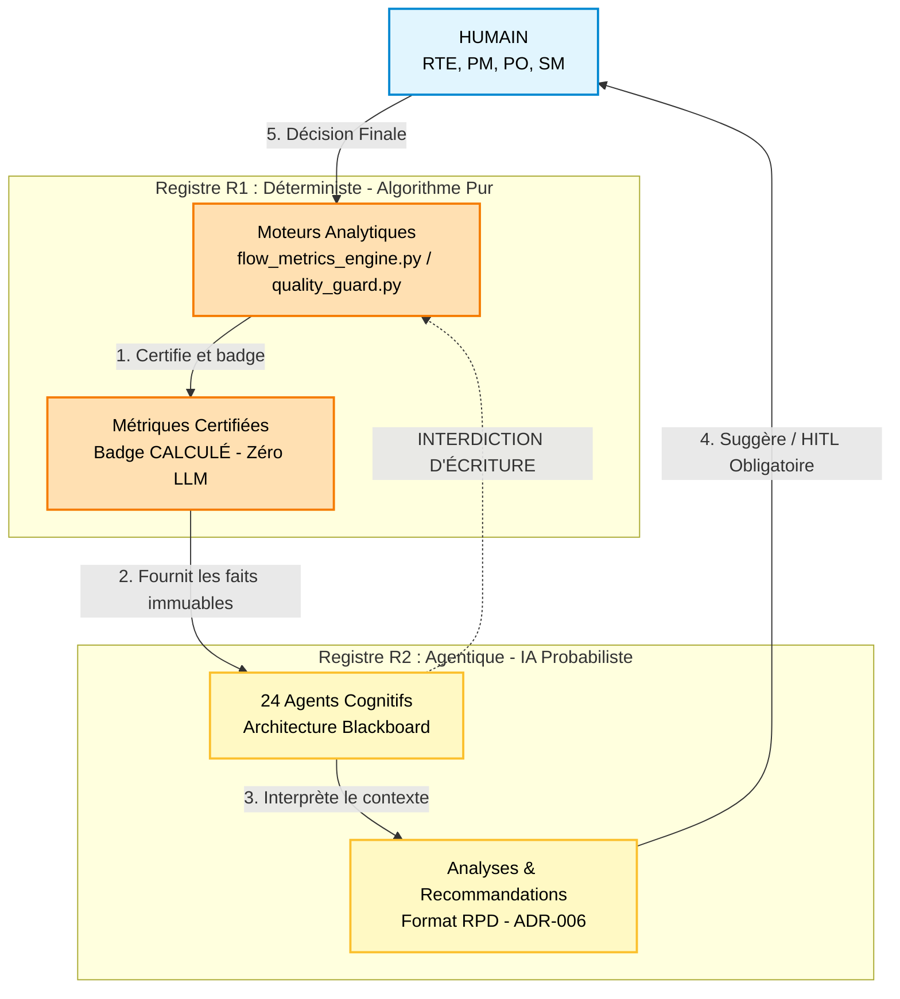

# Niveaux de Certitude Scientifique & Gouvernance

Pour bâtir un **observatoire de santé du train** et mitiger rigoureusement le risque d'hallucination ou de dérive algorithmique au sein des trains SAFe, Neuro-Scale applique un principe de classification et d'isolation strict

Chaque brique de connaissance, chaque métrique et chaque comportement agentique est indexé selon son niveau de maturité et de certitude scientifique.

---

## 1. La Matrice des Niveaux de Certitude (🟢 / 🟡 / 🔴)

Le framework évalue ses fondements théoriques selon trois index stricts. Ce positionnement ne définit pas la valeur d'une règle, mais dicte le **degré d'autonomie** accordé aux agents de la Couche 4 qui l'utilisent.

### 🟢 NIVEAU 1 : ÉTABLI (Contexte individuel / Extrapolé au collectif) 
 * **Définition :** Principes académiques solidement éprouvés à l'échelle individuelle (sciences cognitives, neurosciences), dont l'application à un collectif constitue une extrapolation structurante pour le framework
* **Gouvernance :** **Autonomie Haute.** Le système est autorisé à déclencher des alertes automatisées, des notifications directes et des interrupteurs de flux (ex: blocages de processus ou fonctions `interrupt()`).
* **Exemples phares :**
  * Théorie de la Charge Cognitive (Sweller) : Calibration de la zone de flow entre 40% et 65%.
  * Loi de la Variété Requise (Ashby) : Analogie conceptuelle pour guider la distribution et la granularité multi-agents.
  * Apprentissage en Double Boucle (Argyris & Schön).

### 🟡 NIVEAU 2 : ROBUSTE (Études Consolidées & Nuances)
* **Définition :** Modèles empiriques solides, largement validés sur le terrain des organisations complexes, mais comportant des variables contextuelles humaines.
* **Gouvernance :** **Human-In-The-Loop (HITL) Obligatoire.** Les agents peuvent diagnostiquer et proposer des plans d'action au format RPD (*Recognition-Primed Decision*), mais l'application nécessite une validation humaine (RTE, PM, PO, SM).
* **Exemples phares :**
  * Cadre Cynefin (Snowden) : Routage et classification de la complexité.
  * Systèmes Adaptatifs Complexes (CAS - Holland / Santa Fe).
  * Naturalistic Decision Making (NDM - Klein).

### 🔴 NIVEAU 3 : EXPÉRIMENTAL (Prometteur & Non Consolidé)
* **Définition :** Théories de pointe issues des neurosciences computationnelles ou de la recherche IA émergente, offrant un fort potentiel d'anticipation mais nécessitant une isolation.
* **Gouvernance :** **Mode Observateur Uniquement.** Les composants s'exécutent en arrière-plan sans capacité d'action directe. Ils alimentent la recherche et l'auto-apprentissage sans jamais impacter le delivery ou perturber l'humain.
* **Exemple phare :**
  * Predictive Processing (Clark & Friston) : Détection anticipée des signaux faibles par le moteur `EarlyWarningEngine`.

---

## 2. Découplage R1 / R2 : L'Architecture de Confiance

La gouvernance des certitudes s'appuie sur une séparation étanche entre deux registres logiciels.

* **Le Registre R1 - Déterministe (L'Algorithme) :** C'est le sanctuaire mathématique du système (briques `flow_metrics_engine.py`, `quality_guard.py`). Il audite la qualité des données (INVEST, DoR/DoD) et certifie les mesures. **Zéro LLM, zéro hallucination.**
* **Le Registre R2 - Agentique (L'IA) :** C'est le réseau de neurones organisationnel (24 agents pilotés par l'architecture Blackboard). Les agents interprètent la complexité, croisent les patterns et émettent des recommandations, mais ils ont l'interdiction structurelle de falsifier ou réécrire les faits bruts issus de R1.

---

## 🛡️ La Règle d'Or de la Gouvernance (ADR-001)

L'ADR-001 (Architecture Decision Record) grave dans le marbre le contrat de confiance de Neuro-Scale :

> ⚖️ **Principe de Sûreté Organisationnelle :**
> L'IA suggère, l'algorithme prouve, l'humain décide.
>
> Un agent basé sur un fondement scientifique de niveau 🟢 dispose d'un droit d'interruption automatique du flux opérationnel (ex: `interrupt()` déclenché par `PIReadinessEngine` en cas de non-conformité fatale du backlog à J-15). Un agent opérant sur un fondement 🟡 ou 🔴 est structurellement bridé et doit soumettre ses analyses sous forme de recommandations soumises à arbitrage humain permanent.

---

## 📊 Tableau de Traçabilité des Fondements

| Théorie / Fondement | Certitude | Zone Cible / Indicateur | Composant / Agent Impacté |
| :--- | :---: | :--- | :--- |
| Charge Cognitive (Sweller) | 🟢 | Zone cible de flow : 40% – 65% (Ajustable par configuration,Alerte si > 75%) | `CapacityAgent` / CLI Engine |
| Variété Requise (Ashby) | 🟢 | Analogie structurelle pour la topologie multi-agents | Registre R2 / Architecture Blackboard |
| Double Loop (Argyris & Schön) | 🟢 | Profondeur d'apprentissage organisationnel | `RetroAgent` / Standard ADR-011 |
| Cadre Cynefin (Snowden) | 🟡 | Classification & routage des incidents | `FlowDispatcher` / `CynefinRouter` |
| Systèmes Adaptatifs Complexes (CAS) | 🟡 | Comportement émergent du train | Architecture globale (ADR-012) |
| Naturalistic Decision Making (NDM) | 🟡 | Structuration de l'aide à la décision | Format RPD (Standard ADR-006) |
| Predictive Processing (Clark / Friston) | 🔴 | Détection anticipée des dérives | `EarlyWarningEngine` / `WeakSignalDetector` P3 |

---

## 💡 Indice de Crédibilité des Recommandations

En croisant la certitude théorique avec l'état de fraîcheur des données brutes de R1, le corrélateur central (`DiagnosticOrchestrator`) attribue un label de confiance à chaque diagnostic affiché à l'écran :

* **CALCULÉ :** Données R1 complètes + Fondement 🟢. Certitude maximale.
* **PROBABLE :** Données R1 partielles ou fondement de niveau 🟡. Marge d'erreur signalée.
* **NON VÉRIFIÉ :** Données manquantes ou anomalies critiques en cours sur le Quality Guard. Aucune recommandation agentique n'est générée, le système se met en sécurité.

## ⚠️ Limites intrinsèques et Modes de Défaillance (Failure Modes)

En alignement avec les pratiques des Organisations à Haute Fiabilité (HRO), Neuro-Scale documente ses propres limites opérationnelles :  

* **Dépendance à la culture de saisie :** Si le Data Quality Score de la Phase 2 bloque durablement l'activation de R2, le système reste un simple outil d'audit de données sans valeur prédictive.  
* **Coût d'un faux positif interrupt() :** Un déclenchement erroné d'interruption du flux à J-7 d'un PI Planning peut générer une friction organisationnelle majeure. Le bouton de bypass humain reste prioritaire en toutes circonstances (ADR-001)[cite: 1, 3].
* **Risque de ré-identification :** Bien que l'anonymisation soit opérée à l'échelle de l'équipe, la taille réduite de certains collectifs (5-7 personnes) impose une vigilance stricte quant à l'analyse des métriques pour rester en parfaite conformité avec le droit du travail et les instances représentatives (CSE). 