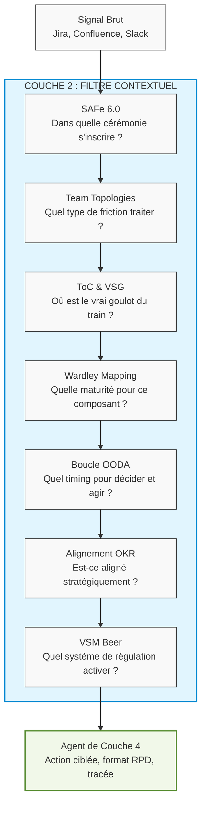

# Les 7 Piliers de la Modélisation Organisationnelle

Si la Couche 1 répond à la question *« Pourquoi ça marche »* (neurosciences, cybernétique), la Couche 2 répond à : **« Dans quel contexte cela s'applique-t-il ? »**.

Sans la Couche 2, les agents de Neuro-Scale posséderaient une puissance de calcul brute mais n'auraient aucun sens du terrain. Ils ne sauraient pas à quelle cérémonie SAFe se brancher, si une friction inter-équipes est saine ou pathologique, ni où se situe le goulot d'étranglement systémique du train. Elle fait office de **filtre contextuel**.

---

## 1. Vue d'Ensemble des 7 Piliers

Chaque pilier apporte une grille de lecture spécifique que les agents traversent avant de générer un diagnostic ou une recommandation :

| Pilier | Rôle Principal | Agent(s) / Composant Core | Statut |
| :--- | :--- | :--- | :---: |
| **SAFe 6.0** | 4 à 5 agents clés activés en MVP (Routine/Commando), autres sous feature flags | `P1 (MVP Restreint)` | |
| **Team Topologies** | Qualification et résolution des frictions inter-équipes | `DependencyAgent` | `P2` |
| **ToC & VSG** | Identification du goulot d'étranglement du flux de valeur | `DependencyAgent` / NetworkX | `P2` |
| **Wardley Mapping** | Évaluation de la position évolutive des composants | `WardleyMapper` / `FlowDispatcher` | `P2` |
| **Boucle OODA** | Cadencement et tempo décisionnel des agents | `DiagnosticOrchestrator` / Méta-cadre | `P2` |
| **Alignement OKR** | Cohérence du delivery avec la stratégie d'entreprise | `FlowDispatcher` (SAS) | `P1 (Implémenté)` |
| **VSM (Beer)** | Diagnostic de viabilité et de régulation systémique | `MentorAgent` (Systèmes S1 à S5) | `P2` |

---

## 2. Cartographie Technique des Piliers Majeurs

### A. SAFe 6.0 & Le Dual-Graph (ADR-025)
Neuro-Scale ne surcharge pas l'organisation avec de nouveaux processus. Il se synchronise sur le rythme cardiaque de SAFe 6.0 à travers deux modes opérationnels distincts :
* **Mode Surveillance (Routine) :** Graphe `analyze_graph`. Analyse continue du flux, de la vélocité et de la charge cognitive au fil des sprints.
* **Mode Commando (PI Readiness) :** Graphe indépendant activé à **T-15 jours** du PI Planning. Il évalue la maturité du backlog (DoR Compliance), les risques de dépendances externes et la stabilité du scope. Si le score composite est critique, le système déclenche un interrupteur de flux (`interrupt()`).

### B. Team Topologies & Théorie des Contraintes (ToC)
Le croisement de ces deux piliers permet au `DependencyAgent` de ne pas simplement lister les dépendances Jira, mais de qualifier leur impact systémique :
* **Analyse de Graphe (ToC) :** Utilisation de structures de données en graphes pour détecter les blocages en chaîne (*Gridlocks*), les dépendances cycliques (*Deadlocks* $A \rightarrow B \rightarrow A$) et les "tickets otages" (un ticket bloquant une part disproportionnée de Story Points).
* **Qualification de la Friction (Team Topologies) :** Identification des ruptures de frontières entre équipes (ex : Stream-aligned vs Complicated-subsystem) pour recommander des réalignements topologiques plutôt que des correctifs temporaires de planning.

---

## 3. Le Filtre Contextuel : Flux de Traitement

Le diagramme suivant illustre comment la Couche 2 transforme un signal brut issu de vos outils de delivery en une action agentique hautement contextualisée :

---

## 4. Mécanisme Transversal : Les Distillats Décisionnels

Pour éviter la saturation du contexte des Modèles de Langage (LLM) et éliminer le risque d'hallucination, Neuro-Scale n'injecte pas l'intégralité des frameworks dans chaque agent. Il utilise des **Distillats**.

Au chargement d'un module, le composant `distillats.py` extrait statiquement du dossier de connaissances (`knowledge/`) un bloc de règles structurées (sans aucun appel LLM) et l'injecte dans le prompt système de l'agent concerné sous la forme d'un `_FRAMEWORK_HEADER`.

### Matrice d'Injection des Distillats

Chaque distillat est classé comme Primaire (l'agent en maîtrise la logique profonde) ou Secondaire (l'agent n'en reçoit que les règles logiques pertinentes sous forme de conditions IF/THEN).

| Agent | Distillats Injectés | Rôle Opérationnel du Distillat |
| :--- | :--- | :--- |
| **FlowDispatcher** | OODA Loop (Primaire) Wardley Mapping (Secondaire) | S'orienter, centraliser les faits du Blackboard et valider la cohérence stratégique globale. |
| **DependencyAgent** | Team Topologies (Primaire) Theory of Constraints (Secondaire) | Cartographier les graphes de dépendances, identifier le goulot et qualifier les frictions inter-équipes. |
| **BacklogAgent** | Theory of Constraints (Primaire) OODA Loop / Team Topologies | Analyser la santé du backlog, raffiner les User Stories vers la conformité INVEST au format Gherkin. |
| **MentorAgent** | VSM Beer (Primaire) | Évaluer la viabilité du modèle d'organisation et pousser des recommandations de restructuration ou d'ajustement. |
| **RetroAgent** | VSM Beer + Team Topologies | Analyser les boucles d'apprentissage lors des rétrospectives pour basculer en Double Boucle. |

---

## 5. Traçabilité et Sûreté de Maintenance

L'utilisation combinée des 7 piliers et des distillats garantit deux règles strictes d'ingénierie logicielle au sein du framework :
* **Traçabilité Décisionnelle (`rule_id`) :** Chaque recommandation, alerte ou diagnostic émis par un agent (Couche 4) doit obligatoirement citer le `rule_id` issu du fichier de configuration du distillat. Aucune décision ne provient de la "mémoire générale" du LLM.
* **Maintenance Centralisée :** Toute suggestion d'évolution des distillats par le RetroAgent (double boucle) prend la forme exclusive d'une Pull Request (proposition, justification textuelle et diff). Ces mutations sont obligatoirement soumises à une validation humaine, versionnées et réversibles (rollback). Le module `distillats.py` (optimisé par un cache `lru_cache`) répercute immédiatement la modification sur l'ensemble des prompts des agents au sprint suivant.