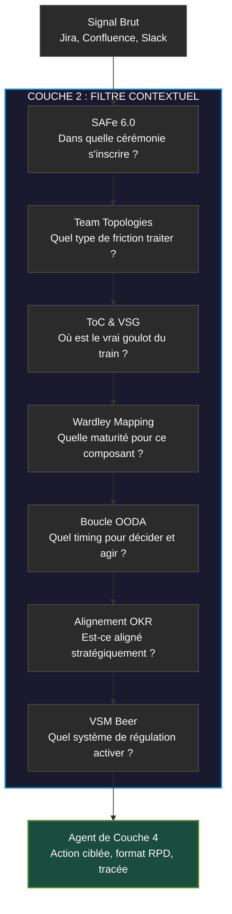

# Les 7 Piliers de la Modélisation Organisationnelle

Si la Couche 1 répond à la question *« Pourquoi ça marche »* (neurosciences, cybernétique), la Couche 2 répond à : **« Dans quel contexte cela s'applique-t-il ? »**.

Sans la Couche 2, les agents de Neuro-Scale posséderaient une puissance de calcul brute mais n'auraient aucun sens du terrain. Ils ne sauraient pas à quelle cérémonie SAFe se brancher, si une friction inter-équipes est saine ou pathologique, ni où se situe le goulot d'étranglement systémique du train. Elle fait office de **filtre contextuel**.

---

## 1. Vue d'Ensemble des 7 Piliers

Chaque pilier apporte une grille de lecture spécifique que les agents traversent avant de générer un diagnostic ou une recommandation :

*Correction de tableau* : la ligne SAFe 6.0 avait ses colonnes décalées (le statut occupait la colonne « Agent / Composant Core », laissant la colonne Statut vide) — corrigée ci-dessous.

| Pilier | Rôle Principal | Agent(s) / Composant Core | Statut |
| :--- | :--- | :--- | :---: |
| **SAFe 6.0** | 4 à 5 agents clés activés en MVP (Routine/Commando), autres sous feature flags | Surface MVP restreinte | `P1 (MVP Restreint)` |
| **Team Topologies** | Qualification et résolution des frictions inter-équipes | `DependencyAgent` (zéro LLM, NetworkX) | `P2` |
| **ToC & VSG** | Identification du goulot d'étranglement du flux de valeur | `DependencyAgent` / NetworkX | `P2` |
| **Wardley Mapping** | Évaluation de la position évolutive des composants | `StrategicAdvisor` (*correction : `WardleyMapper` n'existe pas, cf. `04-gouvernance-ethique/decisions-index.md`, ADR-005*) | `P2` |
| **Boucle OODA** | Cadencement et tempo décisionnel des agents | Distillat `ooda_loop`, injecté par `MentorAgent`/`TriageAgent`/`BacklogAgent` (*correction : pas `DiagnosticOrchestrator`, qui n'importe ni LLM ni LangGraph — cf. `02-moteur-architecture/cerveau-core.md`*) | `P2` |
| **Alignement OKR** | Cohérence du delivery avec la stratégie d'entreprise | `okr_engine.py` (R1, appelé par `flow_dispatcher_node`) | `P1 (Implémenté)` |
| **VSM (Beer)** | Diagnostic de viabilité et de régulation systémique | `RetroAgent` (*correction : pas `MentorAgent`, qui injecte `theory_of_constraints`/`ooda_loop` — cf. `02-moteur-architecture/agents-specialite.md`*) | `P2` |

---

## 2. Cartographie Technique des Piliers Majeurs

### A. SAFe 6.0 & Le Dual-Graph (ADR-019)
*Correction* : le Dual-Graph est l'ADR-019, pas l'ADR-025 (indépendance de déploiement des graphes) — cf. `04-gouvernance-ethique/decisions-index.md`. Neuro-Scale ne surcharge pas l'organisation avec de nouveaux processus. Il se synchronise sur le rythme cardiaque de SAFe 6.0 à travers deux modes opérationnels distincts :
* **Mode Surveillance (Routine) :** Graphe `analyze_graph`. Analyse continue du flux, de la vélocité et de la charge cognitive au fil des sprints.
* **Mode Commando (PI Readiness) :** activé à **T-15 jours** du PI Planning. Il évalue la maturité du backlog (DoR Compliance), les risques de dépendances externes et la stabilité du scope. Si le score composite passe sous 60 %, le graphe route vers `human_review` — *correction* : le mécanisme réel est `interrupt_before=["human_review"]` (`graph.py:1289`), pas un appel direct à `interrupt()`, cf. `03-guides-roles/rte-pi-readiness.md`.

### B. Team Topologies & Théorie des Contraintes (ToC)
Le croisement de ces deux piliers permet au `DependencyAgent` de ne pas simplement lister les dépendances Jira, mais de qualifier leur impact systémique :
* **Analyse de Graphe (ToC) :** Utilisation de structures de données en graphes pour détecter les blocages en chaîne (*Gridlocks*), les dépendances cycliques (*Deadlocks* $A \rightarrow B \rightarrow A$) et les "tickets otages" (un ticket bloquant une part disproportionnée de Story Points).
* **Qualification de la Friction (Team Topologies) :** Identification des ruptures de frontières entre équipes (ex : Stream-aligned vs Complicated-subsystem) pour recommander des réalignements topologiques plutôt que des correctifs temporaires de planning.

---

## 3. Le Filtre Contextuel : Flux de Traitement

Le diagramme suivant illustre comment la Couche 2 transforme un signal brut issu de vos outils de delivery en une action agentique hautement contextualisée :

```mermaid
graph TD
    %% Style Global
    classDef default fill:#2b2b2b,stroke:#555,stroke-width:1px,color:#ffffff;
    classDef core fill:#004b6e,stroke:#0288d1,stroke-width:2px,color:#ffffff;
    classDef agent fill:#1b4d3e,stroke:#558b2f,stroke-width:2px,color:#ffffff;

    %% Style spécifique pour le subgraph
    style Couche2 fill:#1a1a2e,stroke:#0288d1,stroke-width:2px,color:#ffffff;

    %% Nœuds
    Signal[Signal Brut<br/>Jira, Confluence, Slack]
    
    subgraph Couche2 [COUCHE 2 : FILTRE CONTEXTUEL]
        SAFe[SAFe 6.0<br/>Dans quelle cérémonie s'inscrire ?]
        TT[Team Topologies<br/>Quel type de friction traiter ?]
        ToC[ToC & VSG<br/>Où est le vrai goulot du train ?]
        Wardley[Wardley Mapping<br/>Quelle maturité pour ce composant ?]
        OODA[Boucle OODA<br/>Quel timing pour décider et agir ?]
        OKR[Alignement OKR<br/>Est-ce aligné stratégiquement ?]
        VSM[VSM Beer<br/>Quel système de régulation activer ?]
    end

    Agent[Agent de Couche 4<br/>Action ciblée, format RPD, tracée]

    %% Liaisons
    Signal --> SAFe
    SAFe --> TT
    TT --> ToC
    ToC --> Wardley
    Wardley --> OODA
    OODA --> OKR
    OKR --> VSM
    VSM --> Agent

    %% Assigner les classes
    class Couche2 core;
    class Agent agent;
```

---

## 4. Mécanisme Transversal : Les Distillats Décisionnels

Pour éviter la saturation du contexte des Modèles de Langage (LLM) et éliminer le risque d'hallucination, Neuro-Scale n'injecte pas l'intégralité des frameworks dans chaque agent. Il utilise des **Distillats**.

Au chargement d'un module, le composant `distillats.py` extrait statiquement du dossier `Documentation/` (*correction de chemin — pas `knowledge/`*) un bloc de règles structurées (sans aucun appel LLM) et l'injecte dans le prompt système de l'agent concerné sous la forme d'un `_FRAMEWORK_HEADER`. Chaque agent appelle lui-même `build_framework_context()` à l'import de son module — il n'existe pas de composant central qui « distribue » les distillats.

### Matrice d'Injection des Distillats (réelle, vérifiée par lecture directe du code)

*Correction* : aucune classification « Primaire/Secondaire » n'existe dans le code — retirée (cf. `02-moteur-architecture/gestion-distillats.md`). Seuls **5 agents sur l'ensemble du registre** injectent effectivement un distillat :

| Agent | Distillats Injectés (réels) | Rôle Opérationnel |
| :--- | :--- | :--- |
| **MentorAgent** | Theory of Constraints, OODA Loop | Support et posture agile pour le RTE. |
| **StrategicAdvisor** | Wardley Mapping | Classification évolutive des composants. |
| **RetroAgent** | VSM Beer, Team Topologies | Synthèse de rétrospectives, double boucle d'apprentissage. |
| **TriageAgent** | OODA Loop | Triage des incidents opérationnels. |
| **BacklogAgent** | OODA Loop, Team Topologies | Raffinement des User Stories (critères INVEST). |

*Retirés, non confirmés* : `FlowDispatcher` (nœud déterministe, zéro LLM, n'injecte aucun distillat) et `DependencyAgent` (zéro LLM, cf. `02-moteur-architecture/agents-specialite.md`) figuraient dans une version précédente de cette matrice comme injecteurs — aucun des deux n'appelle `build_framework_context()`.

---

## 5. Traçabilité et Sûreté de Maintenance

*Correction* : les deux garanties suivantes étaient présentées comme acquises ; vérification faite, elles ne le sont que partiellement.
* **Traçabilité Décisionnelle :** les distillats sources ne contiennent pas de clé `rule_id` — chaque règle porte un `id` court par catégorie (`P1`, `R2`, `S2`... cf. `02-moteur-architecture/gestion-distillats.md`). Le check `_check_rule_id` de l'`EvaluatorAgent` cite un `rule_id` que les distillats ne produisent pas sous ce nom — la chaîne de traçabilité est rompue à la source.
* **Maintenance Centralisée :** `RetroAgent` écrit ses propositions de règle dans `state/rule_proposals.md` (pas de mutation directe des distillats, HITL requis — conforme à ce que décrit cette section). En revanche, la propagation « instantanée à l'ensemble des agents » ne concerne que les **5 agents qui injectent effectivement un distillat** (tableau ci-dessus) — pas les 7 piliers ni l'ensemble du registre.