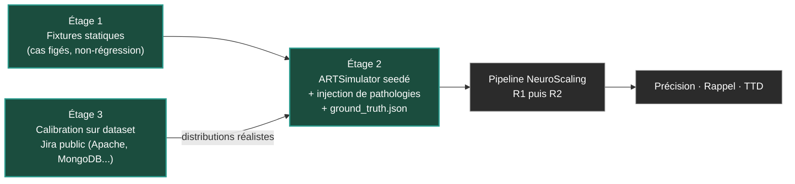

# In Silico : pourquoi NeuroScaling doit d'abord échouer dans un simulateur

> **Statut de ce document — mise à jour du 2026-08-03** : contrairement à la version précédente de cet article, l'**ARTSimulator n'est plus un jalon futur** — il existe (`simulation_package/art_simulator/`, classes `ARTSimulator` et `GroundTruth`) et a déjà été exécuté pour les 4 scénarios ci-dessous (HERMES, TITAN, PHOENIX, NEXUS, seed 42, artefacts dans `output/`). L'API réelle diffère légèrement de la spécification illustrée plus bas (`sim.inject_pathology(PathologyKind.SCOPE_CREEP, ...)` et `fixture, ground_truth = sim.run()`, pas `sim.inject(pathology="...")` / `events, ground_truth = sim.run()`) — l'esprit de l'interface cible a été respecté. Les sections « Ce que le simulateur éprouvera » (lois de Little/Kingman/Shewhart) restent, elles, un chantier non exécuté (`ROAD-PH3-SCI`).

---

## L'objection que ce framework s'adresse à lui-même

« Votre framework n'a jamais tourné en production. »

C'est l'objection la plus légitime que l'on puisse adresser à NeuroScaling — et je préfère la formuler moi-même plutôt que d'attendre qu'on me la fasse. Un framework d'observabilité du delivery qui prétend détecter des gridlocks de dépendances, des dérives de scope ou des saturations cognitives, sans jamais avoir été confronté à un Agile Release Train réel, semble souffrir d'un défaut rédhibitoire.

Cet article défend la position inverse : **commencer par la production serait une erreur de méthode**. Non pas parce qu'un pilote terrain serait trop difficile à obtenir, mais parce qu'un pilote terrain serait *incapable de produire la preuve recherchée*. La démonstration tient en une question simple, développée ci-dessous.

## Pourquoi la production ne peut pas prouver

Supposons NeuroScaling déployé chez un client dès demain. Sur un Program Increment complet, le système lève quarante alertes : des dépendances jugées critiques, des équipes signalées en surcharge, des features déclarées à risque.

Deux questions décident de la valeur du système :

1. Parmi ces quarante alertes, **combien correspondaient à un problème réel** ? (précision)
2. Parmi les problèmes réels du PI, **combien le système en a-t-il détecté** ? (rappel)

Et voici le point aveugle : **personne ne peut répondre**. Sur un train réel, aucun acteur ne labellise les événements au fil de l'eau — personne n'écrit « ceci était un gridlock naissant à J-12 » dans un registre de vérité. Le problème détecté a-t-il été évité *grâce à* l'alerte, ou n'existait-il pas ? La dérive non détectée a-t-elle eu lieu, ou a-t-elle été absorbée silencieusement par les équipes ? Les données de production n'ont **pas de vérité terrain**.

La conséquence est brutale pour toute démarche de validation : un pilote qui « s'est bien passé » produit un témoignage, pas une mesure. Il alimente une étude de cas commerciale, jamais un dossier de preuve. Et l'asymétrie des coûts aggrave le tableau : une erreur de calibrage découverte en production se paie en sprints perdus et en confiance érodée, quand la même erreur découverte sur un banc d'essai se paie en minutes de calcul.

D'autres disciplines ont affronté ce paradoxe bien avant l'agilité à l'échelle. La pharmacologie teste ses molécules *in silico* avant tout essai humain. L'aéronautique fait voler ses commandes de vol dans des simulateurs des milliers d'heures avant le premier décollage. Le principe commun : **quand le terrain ne peut pas prouver — ou que l'échec y coûte trop cher — on construit un banc d'essai où la vérité est connue par construction.**

C'est exactement la définition de la stratégie In Silico de NeuroScaling.

## L'ARTSimulator : architecture cible à trois étages

Le banc d'essai reposera sur une architecture à trois étages, chacun répondant à une faiblesse spécifique des approches de validation classiques.



**Étage 1 — Les fixtures statiques.** Des jeux de données JSON figés, déjà utilisés pour les tests unitaires du pipeline. Nécessaires, mais structurellement insuffisants : un instantané ne teste pas la dimension temporelle d'un PI — or c'est précisément dans la *trajectoire* (une vélocité qui s'érode, une chaîne de blocages qui s'allonge) que vivent les pathologies intéressantes.

**Étage 2 — Le cœur du dispositif.** L'ARTSimulator sera un générateur stochastique **seedé** : il produira un PI complet d'événements Jira-like — transitions de statuts, créations de dépendances, variations de vélocité par équipe — à partir de distributions paramétrées. Chaque pathologie sera un paramètre injectable :

```python
# Interface cible (spécification)
sim = ARTSimulator(seed=42, teams=8, pi_length_days=70)
sim.inject(pathology="scope_creep", team="Alpha", day=35, intensity=0.4)
sim.inject(pathology="dependency_gridlock", teams=["Beta", "Gamma", "Delta"], day=20)
events, ground_truth = sim.run()   # flux d'événements + vérité terrain labellisée
```

La sortie est double, réellement produite à chaque run : la fixture d'événements que le pipeline NeuroScaling analyse *sans connaître les injections*, et un `ground_truth.json` généré par la classe `GroundTruth` (`simulation_package/art_simulator/ground_truth.py`) qui les consigne — nature, équipe, jour d'injection, intensité (vérifié dans `output/titan_seed42/ground_truth.json` et les 3 autres scénarios). La comparaison des deux fournit ce que la production ne fournira jamais : des métriques de détection auditables.

Un point d'architecture non négociable : le simulateur sera **100 % algorithmique** — stochastique mais seedé, donc parfaitement reproductible, et sans le moindre appel LLM, en cohérence avec la séparation stricte entre couche déterministe et couche agentique (ADR-001). Une simulation qu'on ne peut pas rejouer à l'identique est une opinion déguisée en expérience. Il vivra dans un répertoire dédié `simulator/`, distinct des moteurs de production : c'est un instrument de laboratoire, pas un composant du produit.

**Étage 3 — L'ancrage dans le réel.** L'objection naturelle au synthétique est le réalisme : un générateur mal calibré produit des données trop propres, que n'importe quel détecteur réussit. La réponse existe, et elle est académique : le **dataset public de dépôts Jira** publié par Montgomery, Lüders et Maalej (Université de Hambourg) à la conférence MSR 2022. Ce corpus agrège **16 instances Jira publiques — dont Apache, MongoDB, RedHat, Qt et Spring — soit 1 822 projets, 2,7 millions de tickets, 32 millions de changements historisés et 1 million de liens inter-tickets**, le tout distribué sous licence ouverte (CC BY 4.0) sur Zenodo.

Deux propriétés de ce dataset le rendent précisément adapté à la calibration de l'ARTSimulator :

- **Les changelogs complets.** Chaque ticket embarque l'historique de ses transitions de statut, horodatées. C'est la matière première exacte des distributions que le générateur doit imiter : temps de séjour par statut, cadence des mises à jour, profils de stagnation. Les auteurs soulignent d'ailleurs que cette dimension évolutive des tickets n'avait jamais pu être étudiée directement, faute de données — c'est elle que le simulateur exploitera.
- **La cartographie des liens de dépendance.** Le dataset unifie qualitativement les types de liens entre tickets, dont les types *Block* (un ticket ne peut être résolu tant qu'un autre ne l'est pas) et *Depend* — soit exactement la sémantique des arêtes `BLOQUÉ_PAR` du Knowledge Graph de NeuroScaling. Les topologies réelles de ces graphes de blocage (profondeur des chaînes, densité, motifs de cascade) calibreront l'injecteur de pathologies de dépendances.

Ces projets open source ne sont pas des trains SAFe, et cette limite est assumée plus bas ; mais ils fournissent des distributions *empiriques* de comportements Jira authentiques — structures, délais, bruit textuel des descriptions et commentaires — très supérieures à des paramètres choisis à la main. La revendication finale sera précise et vérifiable : « générateur calibré sur le dataset Jira public de Montgomery et al. », rien de plus.

## Ce que le simulateur éprouvera : les calibrages scientifiques de l'architecture

Trois apports scientifiques sont à l'étude pour enrichir l'architecture NeuroScaling (`ROAD-PH3-SCI`) : la loi de Little, la formule de Kingman et les cartes de contrôle de Shewhart. Leur promesse est de faire passer les seuils et les détecteurs du framework du statut de configuration empirique à celui de calibrage mathématiquement fondé. Et c'est précisément là que le simulateur trouve son second rôle : avant d'intégrer définitivement ces calibrages, **il permettra de les mettre à l'épreuve** — chaque loi candidate devra prouver sur le banc d'essai qu'elle améliore réellement la détection.

**La loi de Little** relie les trois grandeurs fondamentales d'un flux stable :

```math
L = \lambda \cdot W
```

où L est l'encours moyen (WIP), λ le débit et W le temps de traversée. Elle fournirait au registre déterministe une grille de lecture unifiée de ses métriques de flux.

**La formule de Kingman** (théorie des files d'attente, 1961) donne l'ordre de grandeur du temps d'attente d'une file G/G/1 :

```math
W_q \approx \left(\frac{\rho}{1-\rho}\right) \cdot \left(\frac{C_a^2 + C_s^2}{2}\right) \cdot \tau
```

où ρ est le taux d'utilisation, C_a et C_s les coefficients de variation des arrivées et des services, et τ le temps de service moyen. Le terme ρ/(1−ρ) diverge quand ρ tend vers 1 : c'est la démonstration mathématique que la relation entre charge et délai n'est **pas linéaire**, et c'est elle qui donnerait au seuil de saturation de NeuroScaling un ancrage théorique — le seuil restant, conformément aux principes du projet, une *configuration initiale empirique ajustable par train*, non une constante universelle.

**Les cartes de contrôle XmR de Shewhart** équiperaient le détecteur de patterns : elles distinguent la variation de cause commune (le bruit naturel d'une vélocité d'équipe) de la variation de cause spéciale (un signal réel), tuant les faux positifs qu'un seuil naïf en pourcentage générerait.

Le simulateur permettra alors de poser, pour la première fois, les questions qui valident ou invalident ces choix :

- Le seuil de saturation détecte-t-il la surcharge injectée, et avec quel temps de détection (TTD) en jours simulés ?
- Les limites XmR réduisent-elles effectivement le taux de fausses alertes par rapport à un seuil fixe, à rappel égal ?
- La courbe de Kingman prédite par le modèle correspond-elle à la dégradation de lead time observée dans le jumeau quand on pousse l'utilisation au-delà du seuil ?

Chaque réponse sera un chiffre, pas un adjectif.

## La rejouabilité comme méthode

C'est ici que la stratégie In Silico dépasse le simple « test avant production » — et c'est l'argument décisif face à l'objection initiale.

Quatre scénarios canoniques constitueront la suite de validation permanente du framework :

- **HERMES** — dérive de scope majeure à J-15 du PI Planning (éprouve le moteur de préparation PI et le cran de sûreté d'interruption) ;
- **TITAN** — gridlock de dépendances en cascade sur plus de quinze équipes (éprouve l'analyse de graphe et la détection de blocages structurels) ;
- **PHOENIX** — rupture topologique avec explosion de la charge cognitive (éprouve l'indice de charge et le seuil de saturation) ;
- **NEXUS** — dérive insidieuse des règles métier (éprouve le circuit de proposition et de validation humaine des évolutions de règles).

Ces scénarios ne seront pas des démonstrations : ils seront des **tests de non-régression de l'architecture elle-même**. Chaque évolution significative du framework — un seuil recalibré, une règle de détection modifiée, une décision d'architecture nouvelle — sera rejouée contre la suite complète, à seed identique, et comparée aux résultats de la version précédente. Une régression de rappel sur TITAN ou une explosion de fausses alertes sur PHOENIX sera détectée *avant* d'atteindre quiconque.

C'est le renversement complet de l'objection de départ. Une réorganisation réelle ne se rejoue pas ; un PI perdu ne se rembourse pas ; un pilote client ne se recommence pas dans les mêmes conditions. Une simulation seedée, si — indéfiniment, à l'identique, paramètre par paramètre. « Non testé en production » devient : **testé dans des conditions que la production ne permettra jamais** — vérité terrain connue, pathologies à la demande, reproductibilité totale, comparabilité entre versions.

Le pilote terrain reste l'horizon, et il viendra. Mais il arrivera devant un système dont la capacité de détection aura déjà été mesurée, chiffrée et — au sens propre — **falsifiable** : les scénarios, les seeds et les métriques attendues seront publiés, et quiconque pourra rejouer l'expérience.

## Gouvernance : ce que le simulateur n'est pas

Trois garde-fous délimitent le dispositif, dans la continuité des principes du framework.

**Zéro LLM dans le moteur de simulation** (ADR-001). La reproductibilité par seed est la condition de toute la démarche ; elle interdit tout composant stochastique non contrôlé dans le générateur. Les agents cognitifs sont *l'objet testé*, jamais l'instrument de test.

**Zéro individu modélisé** (ADR-004). Le jumeau simule des agrégats d'équipe — vélocités, encours, dépendances — jamais des personnes. Ce principe, non négociable en production, s'applique à l'identique au laboratoire : un banc d'essai qui modéliserait des individus normaliserait l'idée qu'on peut le faire.

**Le simulateur informe, l'humain décide.** Les résultats in silico éclairent des arbitrages — un seuil, une topologie, un calendrier — ils n'en automatisent aucun. Un jumeau numérique est un modèle, et un modèle est une simplification utile, pas une prophétie.

## Trois cas d'usage pour un Directeur de Transformation

Au-delà de la validation du framework, le même banc d'essai ouvrira un usage que le marché ne propose pas aujourd'hui : **tester virtuellement une décision organisationnelle avant de la payer en cash et en attrition.**

1. **Scinder une équipe goulot** — simuler l'impact du split sur le lead time global du train avant de l'annoncer, plutôt que de le découvrir deux sprints après.
2. **Calibrer une limite de WIP** — identifier le point de décrochage du délai propre à *ce* train (la courbe de Kingman instanciée sur ses distributions réelles) avant d'imposer une limite arbitraire.
3. **Stress-tester un PI Planning** — injecter les pathologies classiques (dérive de scope, absence clé, dépendance externe en retard) sur la topologie réelle du train et observer quels engagements survivent.

Les organisations testent leur code, leurs sauvegardes et leurs plans de continuité. Leurs réorganisations restent les seuls déploiements majeurs effectués sans environnement de test. Ce n'est pas une fatalité technique ; c'est une habitude.

## Limites assumées

L'honnêteté documentaire est un principe fondateur de ce projet ; elle s'applique d'abord ici.

- **Le simulateur existe et a tourné** (`simulation_package/art_simulator/`, 4 scénarios exécutés à seed 42) ; *correction* : ce n'est plus une limite. Les métriques de précision, de rappel et de TTD comparant les diagnostics NeuroScaling à la vérité terrain n'ont en revanche pas encore été publiées — le simulateur produit des événements et une vérité terrain, la boucle de mesure contre le pipeline R1/R2 reste à instrumenter.
- **Un modèle n'est pas le territoire.** Le jumeau capture les dynamiques de flux et de dépendances ; il ne capture ni le politique, ni le moral des équipes, ni les singularités d'un contexte client. Ses verdicts réduisent l'incertitude, ils ne l'annulent pas.
- **La calibration est une dette permanente.** L'étage 3 n'est pas une étape ponctuelle mais une condition de validité continue : un générateur qui cesse d'être confronté à des distributions réelles dérive vers la complaisance.
- **Le corpus public n'est pas un train SAFe.** Apache ou MongoDB fournissent des distributions Jira réalistes (transitions, liens, bruit textuel), pas des dynamiques d'ART sous cadence PI. La transposition est un choix méthodologique argumenté, pas une équivalence.

## Et maintenant

La stratégie In Silico transforme la principale faiblesse apparente de NeuroScaling — l'absence de terrain — en discipline de validation que peu de frameworks s'imposent : vérité terrain par construction, métriques de détection auditables, non-régression comportementale par scénarios seedés.

Le premier jalon n'est plus à spécifier : HERMES tourne déjà (`run_hermes.py`, seed 42) et produit sa fixture et sa vérité terrain. Reste à poser la question qui donne sa valeur à tout le dispositif : *le pipeline R1/R2 a-t-il vu la dérive de scope injectée, et en combien de jours ?* — c'est la boucle de mesure precision/rappel/TTD, pas encore instrumentée, qui répondra.

La réponse, chiffrée, sera publiée ici.

---

**Référence** — Montgomery L., Lüders C., Maalej W., *« An Alternative Issue Tracking Dataset of Public Jira Repositories »*, MSR 2022 (19th International Conference on Mining Software Repositories). Papier : [arxiv.org/abs/2201.08368](https://arxiv.org/abs/2201.08368) · Données : [doi.org/10.5281/zenodo.5882881](https://doi.org/10.5281/zenodo.5882881) (CC BY 4.0).

---

*Pour l'architecture complète du framework — séparation déterministe/agentique, Knowledge Graph SAFe, gouvernance des agents . Pour discuter de la démarche, le fil LinkedIn associé à cet article est ouvert.*