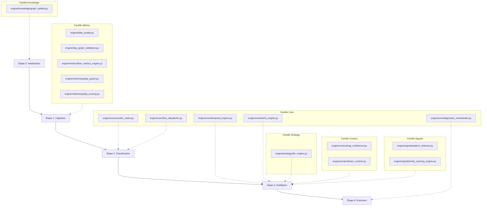
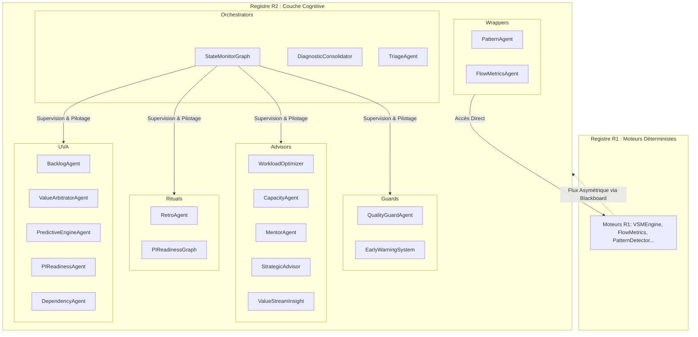

# Neuro-Scale V4 - Registres R1 (Moteurs Déterministes) & R2 (Agents Agentiques)

Contexte : Ce document décrit l'architecture duale de Neuro-Scale V4, séparée en deux registres hermétiques conformément à la gouvernance de l'ADR-001 (`04-gouvernance-ethique/decisions-index.md`) :

* **Registre R1 :** Moteurs déterministes (couche `engine/`) – Zéro dépendance LLM, calculs mathématiques et graphes purs.
* **Registre R2 :** Agents cognitifs et rituels (couche `agents/`) – Intégration LLM, orchestration agentique et LangGraph.

Dernière mise à jour du référentiel cartographique : 19/06/2026

---

## 🔧 Registre R1 : Moteurs Déterministes

### Rôle Global

Les moteurs du Registre R1 forment la couche bas niveau et rationnelle de Neuro-Scale. Responsables des calculs exacts, de l'extraction des métriques et des validations structurelles, ils garantissent une exécution logicielle prévisible sans recourir à des modèles probabilistes (sans LLM).

* **Étanchéité ascendante :** Indépendance absolue vis-à-vis du code R2 (aucun import depuis la couche `agents/` vers `engine/`).
* **Interopérabilité :** Entièrement réutilisables sous forme de services par les agents de la Couche 4 ou via des wrappers s'insérant dans les nœuds LangGraph.
* **Alignement Pipeline :** Chaque composant est affecté à un jalon strict du flux de traitement et de réduction de complexité de la donnée.

### 📊 Cartographie des Composants R1

| Famille | Nom du Composant | Chemin du Fichier | Statut | Rôle Technique & Mission | Étape Pipeline | Dépendances |
| :--- | :--- | :--- | :--- | :--- | :--- | :--- |
| Core | CynefinRouter | `engine/core/cynefin_router.py` | ☑ Opérationnel | Classification des anomalies par scoring sémantique (0-12 pts). | Étape 2 (Classification) | Zéro LLM |
| Core | FlowDispatcher | `engine/core/flow_dispatcher.py` | ☑ Opérationnel | Routage du flux vers la bonne infrastructure (Domaine Compliqué vs Complexe). | Étape 2 (Classification) | Zéro LLM |
| Core | TemporalEngine | `engine/core/temporal_engine.py` | ☑ Opérationnel | Calcul des tendances de vélocité sur N sprints (Minimum requis >= 3). | Étape 3 (Distillation) | Zéro LLM |
| Core | CLIEngine | `engine/context/cli_engine.py` | ☑ Opérationnel | Calcul de l'indice de charge cognitive (Basé sur les 6 composantes de Sweller). | Étape 3 (Distillation) | Zéro LLM |
| Core | CLIEngine (wrapper) | `engine/core/cli_engine.py` | ☑ Opérationnel | Wrapper compatible LangGraph exposant les résultats mathématiques du CLIEngine. | Étape 3 (Distillation) | Zéro LLM |
| Core | DiagnosticOrchestrator | `engine/core/diagnostic_orchestrator.py` | ☑ Opérationnel | Corrélation et arbitrage central (11 règles croisées P1/P2/P3) + Confidence Gate. | Étape 4 (Exécution) | Zéro LLM |
| Metrics | DataQualityEngine | `engine/data_quality.py` | ☑ Opérationnel | Calcul du Data Quality Score (6 dimensions, Note A-E). Gate d'entrée R2 >= 70. | Étape 1 (Captation) | Zéro LLM |
| Metrics | DQSGraphValidators | `engine/dqs_graph_validators.py` | ☑ Opérationnel | Validation de l'intégrité topologique (21 règles DQS) + pont d'injection QualityGuard. | Étape 1 (Captation) | Zéro LLM |
| Metrics | FlowMetricsEngine | `engine/metrics/flow_metrics_engine.py` | ☑ Opérationnel | Extraction automatisée des 6 métriques DORA + Boucle de rétroaction OODA. | Étape 1 (Captation) | Zéro LLM |
| Metrics | QualityGuard | `engine/metrics/quality_guard.py` | ☑ Opérationnel | Scoring de conformité DoR (5 dimensions) générant les statuts CONFIANT/BLOQUANT. | Étape 1 (Captation) | Zéro LLM |
| Metrics | QualityScoring | `engine/metrics/quality_scoring.py` | ☑ Opérationnel | Calcul des indices de confiance (Méthode TF-IDF vectorielle sur 5 dimensions). | Étape 1 (Captation) | Zéro LLM |
| Metrics | VSMEngine | `engine/metrics/vsm_engine.py` | ☑ Opérationnel | Modélisation de la Value Stream (Epic -> Story) via NetworkX (Chemin critique). | Étape 3 (Distillation) | Zéro LLM |
| Metrics | PIReadinessEngine | `engine/metrics/pi_readiness_engine.py` | ☑ Opérationnel | Agrégation déterministe des risques : conformité DoR, dépendances et écarts de capacité. | Étape 3 (Distillation) | Zéro LLM |
| Context | RAGEngine | `engine/context/rag_confluence.py` | ☑ Opérationnel | Moteur RAG TF-IDF déterministe (recherche, classement et détection de contradictions). | Étape 3 (Distillation) | Zéro LLM |
| Context | TeamContext / ARTContext | `engine/context/team_context.py` | ☑ Opérationnel | Profilage statique Team Topologies (budgets cognitifs nominaux, coûts d'interaction). | Étape 3 (Distillation) | Zéro LLM |
| Signals | PatternDetector | `engine/signals/pattern_detector.py` | ☑ Opérationnel | Détection de 27 patterns et cooccurrences SAFe (P01-P15). Modes A (Jira) et B actifs. | Étape 3 (Distillation) | Zéro LLM |
| Signals | EarlyWarningEngine | `engine/signals/early_warning_engine.py` | ☑ Opérationnel | Surveillance des signaux faibles lexicaux via 10 expressions régulières structurées. | Étape 3 (Distillation) | Zéro LLM (Par défaut) |
| Strategy | OKREngine | `engine/strategy/okr_engine.py` | ☑ Opérationnel | Analyse d'alignement par similarité TF-IDF (Backlog ↔ OKR) + calcul du WSJF. | Étape 3 (Distillation) | Zéro LLM |
| Knowledge | graph_builder | `engine/knowledge/graph_builder.py` | ☑ Opérationnel | Bootstrap et génération de l'OntologyGraph de base du train SAFe (8 couches). | Étape 0 (Initialisation) | Zéro LLM |

### 🔍 Spécifications de Sûreté et Directives R1

#### 1. Abstraction LangGraph de CLIEngine (wrapper)

La méthode `as_node()` présente dans `engine/core/cli_engine.py` permet d'exposer les fonctionnalités du moteur au graphe d'orchestration. Bien qu'utilisée comme un nœud de workflow, elle conserve une nature purement déterministe et n'effectue aucun import ni aucun appel vers l'infrastructure LLM. Elle doit demeurer exempte de logique sémantique probabiliste.

#### 2. Configuration de l'EarlyWarningEngine

Conformément à l'isolation du registre, ce composant utilise par défaut le mode d'analyse exclusif par expressions régulières (`use_llm=False`). Le mode hybride optionnel ne peut être activé que sous réserve de validation par le coordinateur central de l'architecture.

### 📈 Schéma Directeur : Flux Métriques R1

---

## 🤖 Registre R2 : Agents Agentiques

### Rôle Global

Les composants du Registre R2 constituent la couche haute et cognitive du framework. Ils orchestrent les flux complexes, effectuent des analyses sémantiques contextuelles et génèrent les recommandations au format standardisé RPD.

* **Consommation asymétrique :** Les composants R2 se nourrissent exclusivement des données structurées et certifiées par le Registre R1 via le Blackboard commun.
* **Intelligence Non Déterministe :** Intégration avancée de modèles de langage (LLM) pour la contextualisation narrative, le raffinement des backlogs, et le support aux rituels du Release Train Engineer (RTE).
* **Interface Externe :** Exposition des endpoints de service API consommés par les applications clientes et le tableau de bord Bento Grid.

### 📊 Cartographie des Composants R2

| Famille | Nom du Composant | Chemin du Fichier | Rôle Technique & Mission | Endpoint API | Dépendances Métiers |
| :--- | :--- | :--- | :--- | :--- | :--- |
| Orchestrators | StateMonitorGraph | `agents/orchestrators/state_monitor_graph.py` | Graphe maître LangGraph régissant le cycle décisionnel complet (9 nœuds). | `POST /workflow/run` | LangGraph, LLM |
| Orchestrators | DiagnosticConsolidator | `agents/orchestrators/diagnostic_consolidator.py` | Synthèse narrative des événements du Blackboard en un diagnostic unifié. | `POST /api/sentinel/check` | LangGraph, LLM (>= 2 events) |
| Orchestrators | TriageAgent | `agents/orchestrators/triage_agent.py` | Qualification et triage automatique des incidents opérationnels entrants. | `POST /uva/triage/incident` | LLM, LangGraph |
| Guards | QualityGuardAgent | `agents/guards/quality_guard_agent.py` | Wrapper et barrière de sécurité (Gate R2) s'appuyant sur les données de QualityGuard. | — | QualityGuard (R1) |
| Guards | EarlyWarningSystem | `agents/guards/early_warning_system.py` | Interrupteur d'alerte. Déclenche une gate HITL si la densité des signaux est >= 80%. | — | EarlyWarningEngine (R1) |
| Advisors | WorkloadOptimizer | `agents/advisors/workload_optimizer.py` | Classe de base abstraite régissant l'optimisation des flux de travail. | — | Zéro LLM |
| Advisors | CapacityAgent | `agents/advisors/capacity_agent.py` | Calcul de la zone cible de Flow (Csikszentmihalyi 40-65%) et émission du payload RPD. | `GET /uva/capacity/{team}` | Logiciel Déterministe |
| Advisors | MentorAgent | `agents/advisors/mentor_agent.py` | Support et posture agile pour le RTE selon 5 modes d'interaction (JIT, Shadow, Dette, etc.). | `POST /uva/mentor/*` | LLM |
| Advisors | StrategicAdvisor | `agents/advisors/strategic_advisor.py` | Évaluation de l'effort via classification Wardley Map et alignement des objectifs macro. | `POST /uva/wardley/classify` | LLM |
| Advisors | ValueStreamInsight | `agents/advisors/value_stream_insight.py` | Génération d'insights sémantiques basés sur le chemin critique du VSMEngine. | `POST /uva/vsm/analyze` | VSMEngine (R1), LLM |
| Rituals | RetroAgent | `agents/rituals/retro_agent.py` | Analyse sémantique des données de rétrospectives et mise à jour de la zone d'ontologie R2. | `POST /uva/retro/synthesize` | LLM |
| Rituals | PIReadinessGraph | `agents/rituals/pi_readiness_graph.py` | Orchestration en mode Commando à J-15 du PI Planning. Publication des scores de préparation. | — | PIReadinessEngine (R1), LangGraph |
| UVA | BacklogAgent | `agents/uva/backlog_agent.py` | Analyse qualitative et raffinement automatisé des récits selon les critères INVEST. | `POST /uva/backlog/refine` | LLM |
| UVA | ValueArbitratorAgent | `agents/uva/value_arbitrator_agent.py` | Arbitrage sémantique et financier croisé (Indice CLI vs WSJF). | — | LLM |
| UVA | PredictiveEngineAgent | `agents/uva/predictive_engine_agent.py` | Évaluation prédictive des risques de dérapage des jalons et des livrables clés. | — | LLM |
| UVA | PIReadinessAgent | `agents/uva/pi_readiness_agent.py` | Composant d'interface agentique encapsulant le moteur déterministe de PI Readiness. | `POST /uva/pi-readiness/analyze` | PIReadinessEngine (R1) |
| UVA | DependencyAgent | `agents/uva/dependency_agent.py` | Modélisation et qualification sémantique des dépendances critiques et frictions inter-équipes. | — | LLM |
| Wrappers | PatternAgent | `agents/pattern_agent.py` | Nœud d'interface injectant les comportements du PatternDetector dans les arbres de décision R2. | — | PatternDetector (R1) |
| Wrappers | FlowMetricsAgent | `agents/flow_metrics_agent.py` | Nœud d'interface exposant les indicateurs clés de livraison au Blackboard sémantique. | — | FlowMetricsEngine (R1) |

### 📉 Schéma d'Orchestration Multi-Agents (LangGraph)

---

## 🔄 Matrice de Communication Inter-Registres

Afin d'éviter tout phénomène de dérive ou d'altération des mesures factuelles par une couche cognitive, les interactions entre R1 et R2 sont régies par quatre patterns exclusifs :

| Pattern d'Échange | Composants Impliqués | Description du Flux de Données | Statut de Conformité |
| :--- | :--- | :--- | :--- |
| Encapsulation (Wrapper) | PatternAgent -> PatternDetector | Le nœud R2 appelle une fonction de calcul isolée de R1 pour valider une hypothèse structurelle. | ☑ Conforme (ADR-001) |
| Orchestration Graphe | StateMonitorGraph | Le workflow LangGraph alterne des étapes logiques déterministes et des phases de contextualisation LLM. | ☑ Conforme (ADR-001) |
| Consommation Contextuelle | VSMEngine -> ValueStreamInsight | Les métriques et le chemin critique issus du graphe NetworkX (R1) servent d'injecteurs exclusifs au prompt du LLM (R2). | ☑ Conforme (ADR-001) |
| Altération (Inverse) | R1 ← R2 | Interdiction absolue. Aucun composant d'intelligence artificielle ou d'analyse probabiliste ne peut écrire, écraser ou lisser des données brutes certifiées par R1. | 🚫 Bloqué par design |

---

## 📌 Directives de Maintenance du Code source

Pour préserver la robustesse de l'infrastructure logicielle au fil des cycles de développement, l'ingénierie du framework applique trois règles de maintenance systématiques :

1. **Gouvernance des Exceptions :** Les cas particuliers comme le CapacityAgent (qui réside dans le répertoire `agents/` pour des raisons de couplage avec LangGraph tout en conservant un fonctionnement 100% mathématique) doivent impérativement intégrer une mention claire en commentaire de tête indiquant sa nature déterministe et son intégration LangGraph exclusive via la méthode `as_node()`.
2. **Nettoyage des Fichiers Stubs :** Tout fichier de compatibilité temporaire ou stub n'ayant plus de correspondance fonctionnelle active (comme `agents/orchestrators/cli_agent.py` ou `agents/early_warning_system.py`) doit être définitivement purgé du dépôt principal afin d'éviter les ambiguïtés d'importation.
3. **Standardisation Documentaire :** Chaque nouveau script doit obligatoirement déclarer explicitement son registre d'appartenance (`[R1]` ou `[R2]`) en haut de fichier pour permettre le bon fonctionnement des outils de validation d'architecture automatisés.
