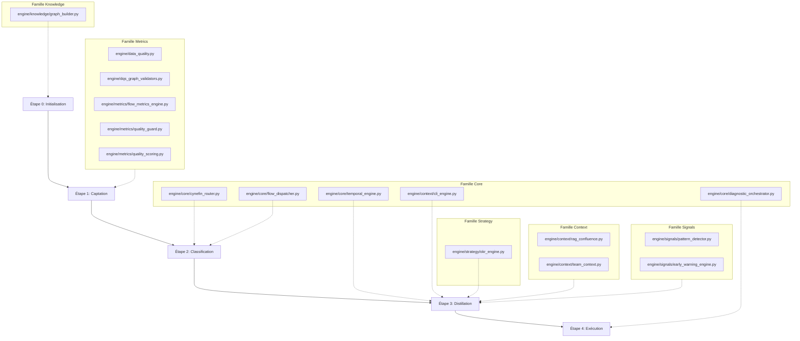
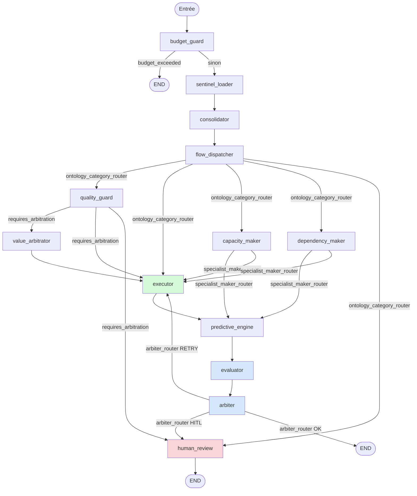

import ZoomMermaid from '@site/src/components/HomepageFeatures/ZoomMermaid.js';

# Neuro-Scale V4 - Registres R1 (Moteurs Déterministes) & R2 (Agents Agentiques)

Contexte : Ce document décrit l'architecture duale de Neuro-Scale V4, séparée en deux registres hermétiques conformément à la gouvernance de l'ADR-001 (`04-gouvernance-ethique/decisions-index.md`) :

* **Registre R1 :** Moteurs déterministes (couche `engine/`) – Zéro dépendance LLM, calculs mathématiques et graphes purs.
* **Registre R2 :** Agents cognitifs et rituels (couche `agents/`) – Intégration LLM, orchestration agentique et LangGraph.

Dernière mise à jour du référentiel cartographique : 19/06/2026
Dernière vérification de conformité code (grep/lecture directe) : **2026-08-02** — voir `CHANGELOG-LOT1-03.md`. Ce registre reste **partiel** : `AUDIT-02 §B` recense ~4 800 LOC vivantes non couvertes ici ; seules les 5 omissions touchant un invariant de gouvernance ont été ajoutées dans cette révision (§ Registre R2, bloc « Gouvernance & Support Cognitif »).

---

## 🔧 Registre R1 : Moteurs Déterministes

### Rôle Global

Les moteurs du Registre R1 forment la couche bas niveau et rationnelle de Neuro-Scale. Responsables des calculs exacts, de l'extraction des métriques et des validations structurelles, ils garantissent une exécution logicielle prévisible sans recourir à des modèles probabilistes (sans LLM).

* **Étanchéité ascendante :** Indépendance absolue vis-à-vis du code R2 (aucun import depuis la couche `agents/` vers `engine/`).
* **Interopérabilité :** Entièrement réutilisables sous forme de services par les agents de la Couche 4 ou via des wrappers s'insérant dans les nœuds LangGraph.
* **Alignement Pipeline :** Chaque composant est affecté à un jalon strict du flux de traitement et de réduction de complexité de la donnée.

### 📊 Cartographie des Composants R1

| Famille | Nom du Composant | Chemin du Fichier | Atteignabilité | Rôle Technique & Mission | Étape Pipeline | Dépendances |
| :--- | :--- | :--- | :--- | :--- | :--- | :--- |
| Core | CynefinRouter | `engine/core/cynefin_router.py` | ✅ Vivant | Classification des anomalies par scoring sémantique (0-12 pts). | Étape 2 (Classification) | Zéro LLM |
| Core | FlowDispatcher | `engine/core/flow_dispatcher.py` | ✅ Vivant | Routage du flux vers la bonne infrastructure (Domaine Compliqué vs Complexe). | Étape 2 (Classification) | Zéro LLM |
| Core | TemporalEngine | `engine/core/temporal_engine.py` | ✅ Vivant | Calcul des tendances de vélocité sur N sprints (Minimum requis >= 3). Ne réévalue aucun seuil (cf. `04-gouvernance-ethique/decisions-index.md`, ADR-032/033). | Étape 3 (Distillation) | Zéro LLM |
| Core | CLIEngine | `engine/context/cli_engine.py` | ✅ Vivant | Calcul de l'indice de charge cognitive (Basé sur les 6 composantes de Sweller). **Code vivant réel** (705 LOC). | Étape 3 (Distillation) | Zéro LLM |
| Core | CLIAgent | `engine/core/cli_engine.py` | 🔶 Orphelin | Classe distincte de `CLIEngine` ci-dessus (même dossier `core/`, nom de fichier identique par collision, contenu différent). Wrapper LangGraph prévu, **jamais importé** par `state_monitor/graph.py` ni par aucun point d'entrée (`analyze.py`, `scripts/`). Le seul importeur est le stub `agents/orchestrators/cli_agent.py`, lui-même orphelin. | Étape 3 (Distillation) | Zéro LLM (affirmation vraie mais sans portée — code mort) |
| Core | DiagnosticOrchestrator | `engine/core/diagnostic_orchestrator.py` | ✅ Vivant | Corrélation et arbitrage central (11 règles croisées P1/P2/P3, chiffre issu de la docstring — non recompté fonction par fonction) + Confidence Gate. | Étape 4 (Exécution) | Zéro LLM |
| Metrics | DataQualityEngine | `engine/data_quality.py` | ✅ Vivant | Calcul du Data Quality Score (6 dimensions nominales, Note A-E). Gate d'entrée R2 >= 70 (seuil littéral en code). | Étape 1 (Captation) | Zéro LLM |
| Metrics | DQSGraphValidators | `engine/dqs_graph_validators.py` | ✅ Vivant | Validation de l'intégrité topologique (**23** fonctions `check_dqs_*`, pas 21) + pont d'injection QualityGuard (D5). **D6 n'a aucune implémentation** — seuls `validate_d1` à `validate_d5` existent ; les « 6 dimensions » de la ligne DataQualityEngine sont nominales, pas toutes exécutables. | Étape 1 (Captation) | Zéro LLM |
| Metrics | FlowMetricsEngine | `engine/metrics/flow_metrics_engine.py` | ✅ Vivant | Extraction automatisée de **5 métriques DORA 2025 + 1 corrélation CLI** (le code se contredit lui-même : docstring l.3 annonce « 6 métriques DORA », l.372 dit « 5 Flow Metrics DORA » — la 6e est `_calc_cli_correlation`, hors DORA). | Étape 1 (Captation) | Zéro LLM |
| Metrics | QualityGuard | `engine/metrics/quality_guard.py` | ✅ Vivant | Scoring de conformité DoR (5 dimensions) générant **3 statuts : CONFIANT (≥80) / AVERTISSEMENT (60-79) / BLOQUANT (moins de 60)** — le niveau intermédiaire existe en code et était absent de cette fiche. | Étape 1 (Captation) | Zéro LLM |
| Metrics | QualityScoring | `engine/metrics/quality_scoring.py` | ✅ Vivant | Calcul des indices de confiance (Méthode TF-IDF vectorielle sur 5 dimensions). | Étape 1 (Captation) | Zéro LLM |
| Metrics | VSMEngine | `engine/metrics/vsm_engine.py` | ✅ Vivant | Modélisation de la Value Stream (Epic -> Story) via NetworkX (Chemin critique). | Étape 3 (Distillation) | Zéro LLM |
| Metrics | PIReadinessEngine | `engine/metrics/pi_readiness_engine.py` | ✅ Vivant | Agrégation déterministe des risques : conformité DoR, dépendances et écarts de capacité. | Étape 3 (Distillation) | Zéro LLM |
| Context | RAGEngine | `engine/context/rag_confluence.py` | ✅ Vivant | Moteur RAG TF-IDF déterministe (recherche, classement et détection de contradictions). | Étape 3 (Distillation) | Zéro LLM |
| Context | TeamContext / ARTContext | `engine/context/team_context.py` | ✅ Vivant | Profilage statique Team Topologies (budgets cognitifs nominaux, coûts d'interaction). | Étape 3 (Distillation) | Zéro LLM |
| Signals | PatternDetector | `engine/signals/pattern_detector.py` | ✅ Vivant | Détection de **15 patterns** (P01-P15). Le docstring du fichier (l.3) annonce à tort « 27 patterns pathologiques SAFe » — fiction dupliquée dans le code, pas seulement documentaire (cf. `02-moteur-architecture/indicateurs-calculs.md`). Modes A (Jira) et B actifs. | Étape 3 (Distillation) | Zéro LLM |
| Signals | EarlyWarningEngine | `engine/signals/early_warning_engine.py` | ✅ Vivant | Surveillance des signaux faibles lexicaux via **7 types / 72 regex**, pas 10 expressions. **Ne pas citer comme preuve de conformité R1** — voir Spécification de Sûreté #2 ci-dessous. | Étape 3 (Distillation) | ❌ **LLM réel** (`use_llm=True` par défaut, l.369) — voir détail ci-dessous |
| Strategy | OKREngine | `engine/strategy/okr_engine.py` | ✅ Vivant | Analyse d'alignement par similarité TF-IDF (Backlog ↔ OKR). Calcule uniquement le **sous-facteur Business Value du WSJF** (échelle SAFe 1/2/3/5/8/13/20, `_suggest_business_value`) — pas la formule WSJF complète (Time Criticality, Risk Reduction, Job Size absents). Ne pas annoncer « calcul du WSJF » sans cette précision. | Étape 3 (Distillation) | Zéro LLM |
| Knowledge | graph_builder | `engine/knowledge/graph_builder.py` | ✅ Vivant | Bootstrap et génération du **`KnowledgeGraph`** (R1) de base du train SAFe (8 couches confirmées). Le module importe `neuro_scale.graph.knowledge_graph.KnowledgeGraph`, pas `OntologyGraph` (Zone R2) — confusion tranchée par ADR-036. | Étape 0 (Initialisation) | Zéro LLM |
| Core | outcome_journal | `engine/core/outcome_journal.py` | ✅ Vivant | **Absent de ce registre jusqu'à cette révision** (20e module `engine/`, 19 seulement documentés). Journalisation et calcul du taux de correction de trajectoire (`compute_roc`) des diagnostics émis — support de la boucle ADR-011. | Étape 4 (Exécution) | Zéro LLM |

### 🔍 Spécifications de Sûreté et Directives R1

#### 1. Abstraction LangGraph de CLIEngine (wrapper) — témoin invalide, à ne plus citer

`engine/core/cli_engine.py::CLIAgent` (méthode `as_node()`) n'effectue en effet aucun import ni appel LLM — mais ce fichier est **orphelin** (voir colonne Atteignabilité ci-dessus) : il n'est invoqué par aucun graphe réel. Ce n'est donc pas une preuve exploitable de la pureté R1 en exécution, seulement une propriété d'un fichier mort. Le composant vivant équivalent est `engine/context/cli_engine.py::CLIEngine`, qui ne dépend pas non plus d'un LLM (grep exhaustif).

#### 2. Configuration de l'EarlyWarningEngine — contre-preuve de conformité R1, pas une preuve

**Cette section servait jusqu'ici de témoin de conformité à ADR-001 ; c'est l'inverse qui est vrai.** `engine/signals/early_warning_engine.py` :

* Le défaut réel du paramètre est **`use_llm=True`** (`early_warning_engine.py:369`), pas `False`. Seul un appelant particulier (le wrapper R2, `agents/guards/early_warning_system.py`) passe explicitement `False`.
* Quand `use_llm=True`, le moteur exécute un **appel LLM réel** : une requête `POST` via `urllib` vers `localhost:1234/v1/chat/completions` (LM Studio), fonction `query_llm()` invoquée dans le chemin d'exécution (`early_warning_engine.py:440`).
* Ce composant réside dans `engine/signals/`, la couche R1 censée être « zéro LLM » (ADR-001). C'est donc une **violation active de l'invariant**, pas son illustration — écart documenté sous `DRIFT-001`, arbitrage en attente. Ne plus le citer comme preuve de conformité tant que l'arbitrage n'a pas tranché.
* Ce composant est par ailleurs listé comme `☑ Opérationnel` en R1 alors qu'il appelle un LLM : au sens strict de la définition R1 du chapeau (« Zéro dépendance LLM »), sa présence même dans ce tableau est en tension avec la colonne Famille — signalé ici sans reclassement, faute de convention établie pour ce cas.

### 📈 Schéma Directeur : Flux Métriques R1

---

## 🤖 Registre R2 : Agents Agentiques

### Rôle Global

Les composants du Registre R2 constituent la couche haute et cognitive du framework. Ils orchestrent les flux complexes, effectuent des analyses sémantiques contextuelles et génèrent les recommandations au format standardisé RPD.

* **Consommation asymétrique :** Les composants R2 se nourrissent exclusivement des données structurées et certifiées par le Registre R1 via le Blackboard commun.
* **Intelligence Non Déterministe :** Intégration avancée de modèles de langage (LLM) pour la contextualisation narrative, le raffinement des backlogs, et le support aux rituels du Release Train Engineer (RTE).
* **Interface Externe :** Exposition des endpoints de service API consommés par les applications clientes et le tableau de bord Bento Grid.

### 📊 Cartographie des Composants R2

| Famille | Nom du Composant | Chemin du Fichier | Atteignabilité | Rôle Technique & Mission | Endpoint API | Dépendances Métiers |
| :--- | :--- | :--- | :--- | :--- | :--- | :--- |
| Orchestrators | StateMonitorGraph | `agents/orchestrators/state_monitor/graph.py` | ✅ Vivant | Graphe maître LangGraph régissant le cycle décisionnel complet (**13 nœuds**, pas 9 — `graph.py:1208-1220`). Chemin de fichier corrigé : refactor fichier plat → sous-package (`state_monitor_graph.py` → `state_monitor/graph.py`) jamais propagé dans cette doc. | `POST /workflow/run` | LangGraph, LLM |
| Orchestrators | DiagnosticConsolidator | `agents/orchestrators/diagnostic_consolidator.py` | ✅ Vivant | Synthèse narrative des événements du Blackboard en un diagnostic unifié. **Fiche témoin, aucune correction.** | `POST /api/sentinel/check` | LangGraph, LLM (>= 2 events) |
| Orchestrators | TriageAgent | `agents/orchestrators/triage_agent.py` | ✅ Vivant | Qualification et triage automatique des incidents opérationnels entrants. | `POST /uva/triage/incident` | LLM, LangGraph |
| Guards | QualityGuardAgent | `agents/guards/quality_guard_agent.py` | ✅ Vivant | Wrapper et barrière de sécurité (Gate R2) s'appuyant sur les données de QualityGuard. Servi via un chemin de compatibilité (`agents/quality_guard/agent.py`, re-export de cette même classe) par `api/routers/quality_guard_router.py` (`POST /quality-guard/evaluate`) — une seule classe réelle, pas deux, mais deux chemins d'import. | `POST /quality-guard/evaluate` | QualityGuard (R1) |
| Guards | EarlyWarningSystem | `agents/guards/early_warning_system.py` | 🔶 Orphelin | Interrupteur d'alerte. Seuil HITL 80 % exact. **Aucun import** trouvé dans `src/`, `scripts/`, `analyze.py` — le seul chemin qui l'atteint est le stub `agents/early_warning_system.py`, lui-même non importé ailleurs. | — | EarlyWarningEngine (R1) |
| Advisors | WorkloadOptimizer | `agents/advisors/workload_optimizer.py` | ✅ Vivant | **Classe concrète**, pas une classe de base abstraite (aucune `ABC`/`abstractmethod` en code). Instancie directement `JiraAdapter` et est utilisée telle quelle par `api/routers/uva_router.py:14,29`. | — | Zéro LLM |
| Advisors | CapacityAgent | `agents/advisors/capacity_agent.py` | ✅ Vivant | Calcul de la zone cible de Flow (Csikszentmihalyi 40-65%) et émission du payload RPD. **Fiche de référence** — zéro LLM confirmé par grep exhaustif, zone 40-65 % et seuil 75 % exacts. Aucune correction. | `GET /uva/capacity/{team}` | Logiciel Déterministe |
| Advisors | MentorAgent | `agents/advisors/mentor_agent.py` | ✅ Vivant | Support et posture agile pour le RTE selon 5 modes d'interaction (JIT, Shadow, Dette, etc.) — 5 modes = 5 appels LLM distincts. | `POST /uva/mentor/*` | LLM |
| Advisors | StrategicAdvisor | `agents/advisors/strategic_advisor.py` | ✅ Vivant | Évaluation de l'effort via classification Wardley Map et alignement des objectifs macro. **C'est ici, et non dans un composant `WardleyMapper` (inexistant), qu'est implémenté le Wardley Mapping** — cf. `04-gouvernance-ethique/decisions-index.md`, ADR-005. | `POST /uva/wardley/classify` | LLM |
| Advisors | ValueStreamInsight | `agents/advisors/value_stream_insight.py` | ✅ Vivant | Génération d'insights basés sur le chemin critique du VSMEngine. **Dépendance LLM inexacte** — aucun `get_llm()`/appel LLM trouvé dans le fichier ; la dépendance réelle est uniquement `VSMEngine` (R1). | `POST /uva/vsm/analyze` | VSMEngine (R1) — **zéro LLM**, pas « VSMEngine, LLM » |
| Rituals | RetroAgent | `agents/rituals/retro_agent.py` | ✅ Vivant | Analyse sémantique des données de rétrospectives et mise à jour de la zone d'ontologie R2. | `POST /uva/retro/synthesize` | LLM |
| Rituals | PIReadinessGraph | `agents/rituals/pi_readiness_graph.py` | 🔶 Orphelin | Orchestration en mode Commando à J-15 du PI Planning. Publication des scores de préparation. **Contient le seul `interrupt()` réel du dépôt** (`pi_readiness_graph.py:118`) — mais ce module n'est importé nulle part (seul importeur : le stub orphelin `agents/pi_readiness_graph.py`). Conséquence directe : ADR-026 (arrêt automatique < 60 %) ne peut aujourd'hui se réaliser que dans un graphe mort ; le graphe principal (`state_monitor/graph.py`) utilise `interrupt_before=["human_review"]`, un mécanisme différent. Cf. `DRIFT-036`. | — | PIReadinessEngine (R1), LangGraph |
| UVA | BacklogAgent | `agents/uva/backlog_agent.py` | ✅ Vivant | Analyse qualitative et raffinement automatisé des récits selon les critères INVEST. | `POST /uva/backlog/refine` | LLM |
| UVA | ValueArbitratorAgent | `agents/uva/value_arbitrator_agent.py` | ✅ Vivant | Arbitrage sémantique et financier croisé (Indice CLI vs WSJF). **Précision non demandée par le bon de travaux, ajoutée par vérification croisée** : le composant lit un `feature_wsjf` déjà présent dans l'état (`state.get("feature_wsjf", 0.0)`) — il consomme une valeur WSJF, il ne la calcule pas. Aucun calcul de WSJF complet n'a été trouvé ailleurs dans le dépôt (seul `OKREngine` calcule un sous-facteur, cf. ci-dessus) ; l'origine de `feature_wsjf` n'a pas été tracée dans ce lot. | — | LLM |
| UVA | PredictiveEngineAgent | `agents/uva/predictive_engine_agent.py` | ✅ Vivant | Évaluation prédictive des risques de dérapage des jalons et des livrables clés, invoqué réellement (`graph.py:1217`). **Zéro LLM** — n'importe que `TemporalEngine` (R1) et `core/models.py`, 100 % déterministe malgré son emplacement dans `agents/`. | — | TemporalEngine (R1) — **zéro LLM**, pas « LLM » |
| UVA | PIReadinessAgent | `agents/uva/pi_readiness_agent.py` | ✅ Vivant | Composant d'interface agentique encapsulant le moteur déterministe de PI Readiness. | `POST /uva/pi-readiness/analyze` | PIReadinessEngine (R1) |
| UVA | DependencyAgent | `agents/uva/dependency_agent.py` | ✅ Vivant | Modélisation et qualification des dépendances critiques et frictions inter-équipes. **Zéro LLM** — le code se documente lui-même comme tel (`dependency_agent.py:19` : « ADR-001 — Logique graphe portée depuis simulation_package/, zéro LLM »). | — | Logique graphe (simulation_package) — **zéro LLM**, pas « LLM » |
| Wrappers | PatternAgent | `agents/pattern_agent.py` | 🔶 Orphelin | Nœud d'interface prévu pour injecter les comportements du PatternDetector dans les arbres de décision R2. **132 LOC jamais importées** — aucune occurrence dans `src/`, `scripts/`, `analyze.py` hors de lui-même. | — | PatternDetector (R1) |
| Wrappers | FlowMetricsAgent | `agents/flow_metrics_agent.py` | 🔶 Orphelin | Nœud d'interface prévu pour exposer les indicateurs de livraison au Blackboard. **226 LOC jamais importées.** Sa docstring interne revendique un « enrichissement LLM » et un `WeakSignalDetector` — **aucun des deux n'existe** (0 import LLM, 0 occurrence de `WeakSignalDetector` dans le dépôt) ; ne pas reprendre ces affirmations. | — | FlowMetricsEngine (R1) |

### Gouvernance & Support Cognitif — omissions ajoutées (2026-08-02)

Cinq modules vivants, non listés dans une version précédente de ce registre, touchant directement un invariant de gouvernance (`AUDIT-02 §B`, décision A.3 du bon de travaux 03 — les ~9 autres ensembles omis identifiés par l'audit ne sont volontairement pas repris ici, faute de vérification suffisante ; voir `AUDIT-02 §B` pour la liste complète).

| Famille | Nom du Composant | Chemin du Fichier | Atteignabilité | Rôle Technique & Mission | Dépendances Métiers |
| :--- | :--- | :--- | :--- | :--- | :--- |
| Governance | EvaluatorAgent | `agents/evaluators/evaluator_agent.py` (294 LOC) | ✅ Vivant | **Checker** du Maker-Checker (ADR-032/033), instancié et invoqué à chaque run (`state_monitor/graph.py:229,983`). 4 checks indépendants : `_check_kg`, `_check_threshold`, `_check_rule_id`, `_check_hypothesis`. LLM **distinct** du maker via `call_neuro_scaling_r2` (modèle `EVALUATOR_MODEL`, température 0.0). Réserve connue, résolue et implémentée (`DRIFT-002` → `ADR-037`, 2026-08-03) : le chemin `maker_source == "deterministic"` produit toujours un PASS vacuous sur 3 des 4 checks, mais `evaluate()` retourne désormais `verdict_kind` (`"adversarial"` | `"deterministic_bypass"`), affiché avec un badge distinct dans le rapport HTML — plus de PASS visuellement indiscernable d'un PASS LLM vérifié. **Un doublon divergent existe** — `agents/evaluator_agent.py` (216 LOC, orphelin, aucun importeur trouvé) utilise `get_llm()` directement et n'aurait donc pas l'indépendance de modèle ADR-032 s'il devenait actif par un import erroné (`DRIFT-007`) : c'est le doublon le plus dangereux du dépôt, sa suppression relève du lot 3 sur le code. | LLM (modèle distinct), R2 uniquement |
| Governance | llm_factory | `config/llm_factory.py` (38 LOC) | ✅ Vivant | Point d'injection LLM unique pour le maker R2 (`get_llm()`) — 11 modules en dépendent. C'est le lieu où se joue matériellement ADR-001 côté R2 (le lieu où se joue ADR-001 côté R1 est l'absence totale d'appel, sauf violation `EarlyWarningEngine` documentée ci-dessus). | LLM (factory) |
| Governance | token_guard | `core/token_guard.py` (95 LOC) | ✅ Vivant | Implémentation réelle du capping budgétaire ADR-033 : `enforce_token_budget`, `check_and_track_tokens`, `extract_token_usage`. | Zéro LLM |
| Governance | unit_of_work | `core/unit_of_work.py` (95 LOC) | ✅ Vivant | Mécanisme transactionnel (`UnitOfWork`) qui implémente concrètement l'immutabilité R1 exigée par ADR-021. | Zéro LLM |
| Governance | outcome_journal | `engine/core/outcome_journal.py` (233 LOC) | ✅ Vivant | Voir fiche R1 ci-dessus (20e module `engine/`) — listé ici également car support direct de la boucle de rétroaction ADR-011 côté gouvernance. | Zéro LLM |

**En appui** (non listé comme fiche séparée, cité pour compléter la fiche EvaluatorAgent) : `adapters/llm/r2_client.py` (252 LOC) — fournit `call_neuro_scaling_r2`, `get_r2_client`, le mécanisme qui donne à l'Evaluator son indépendance de modèle vis-à-vis du maker.

### Comptage — composants LLM réels

Le chiffre « 8 agents cognitifs », répété dans plusieurs fichiers du corpus, ne correspond à aucun découpage explicite du code — c'est une coïncidence numérique. Compte vérifié par grep/lecture directe sur cette révision :

* **8 composants R2 "Maker"** appelant un LLM comme générateur : `executor_node` (dans `state_monitor/graph.py`), DiagnosticConsolidator, TriageAgent, MentorAgent, StrategicAdvisor, RetroAgent, BacklogAgent, ValueArbitratorAgent.
* **+ 1 composant "Checker"** : EvaluatorAgent, LLM distinct, ajouté dans cette révision (ci-dessus).
* **Soit 9 composants appelant un LLM au total**, sur 19 + 5 = 24 composants listés dans ce registre (15 R1 vivants + 1 R1 orphelin ; 14 R2 vivants + 4 R2 orphelins + 5 ajouts gouvernance).

À propager tel quel dans les fichiers du corpus qui reprennent ce chiffre (cf. section Propagation du `CHANGELOG-LOT1-03.md`).

### 📉 Schéma d'Orchestration Multi-Agents (LangGraph)

Topologie réelle du graphe `StateMonitorGraph` (13 nœuds), extraite directement de `agents/orchestrators/state_monitor/graph.py:1208-1290`. Remplace un diagramme précédent (supervision hiérarchique SMG → Guards/Advisors/Rituals/UVA) dont 0 des 13 nœuds réels n'apparaissait, ni aucune des 12 arêtes réelles (`AUDIT-02 §E.1/E.2`).

**Points de lecture** :
* Entrée réelle sur `budget_guard` (`set_entry_point`), pas sur un orchestrateur symbolique de supervision hiérarchique.
* 5 routeurs conditionnels nommés en code : `budget_exceeded` (lambda), `ontology_category_router`, `requires_arbitration`, `specialist_maker_router` (réutilisé par `capacity_maker` et `dependency_maker`), `arbiter_router`.
* La boucle `evaluator → arbiter → executor` (RETRY) et la sortie `arbiter → human_review` (HITL) forment le Maker-Checker (ADR-032) — c'est le point que le diagramme précédent ne montrait pas. Le nœud `evaluator` exécute `evaluator_node`, qui instancie `EvaluatorAgent` (fiche « Gouvernance & Support Cognitif » ci-dessous).
* Le graphe est compilé avec `interrupt_before=["human_review"]` (mécanisme réel), **pas** un appel `interrupt()` — cf. `04-gouvernance-ethique/decisions-index.md`, ADR-026.
* `capacity_maker`/`dependency_maker` sont des Makers déterministes (zéro LLM, `ROAD-PH3-X19`) ; seul `executor` appelle un LLM parmi les nœuds de génération.

---

## 🔄 Matrice de Communication Inter-Registres

Afin d'éviter tout phénomène de dérive ou d'altération des mesures factuelles par une couche cognitive, les interactions entre R1 et R2 sont régies par quatre patterns exclusifs :

| Pattern d'Échange | Composants Impliqués | Description du Flux de Données | Statut de Conformité |
| :--- | :--- | :--- | :--- |
| Encapsulation (Wrapper) | PatternAgent -> PatternDetector | Le nœud R2 appelle une fonction de calcul isolée de R1 pour valider une hypothèse structurelle. | ☑ Conforme (ADR-001) |
| Orchestration Graphe | StateMonitorGraph | Le workflow LangGraph alterne des étapes logiques déterministes et des phases de contextualisation LLM. | ☑ Conforme (ADR-001) |
| Consommation Contextuelle | VSMEngine -> ValueStreamInsight | Les métriques et le chemin critique issus du graphe NetworkX (R1) servent d'injecteurs exclusifs au prompt du LLM (R2). | ☑ Conforme (ADR-001) |
| Altération (Inverse) | R1 ← R2 | Interdiction absolue. Aucun composant d'intelligence artificielle ou d'analyse probabiliste ne peut écrire, écraser ou lisser des données brutes certifiées par R1. | 🚫 Bloqué par design |

---

## 📌 Directives de Maintenance du Code source

Pour préserver la robustesse de l'infrastructure logicielle au fil des cycles de développement, l'ingénierie du framework applique trois règles de maintenance systématiques :

1. **Gouvernance des Exceptions :** Les cas particuliers comme le CapacityAgent (qui réside dans le répertoire `agents/` pour des raisons de couplage avec LangGraph tout en conservant un fonctionnement 100% mathématique) doivent impérativement intégrer une mention claire en commentaire de tête indiquant sa nature déterministe et son intégration LangGraph exclusive via la méthode `as_node()`.
2. **Nettoyage des Fichiers Stubs — directive en vigueur, non appliquée :** cette directive existait déjà en visant `agents/orchestrators/cli_agent.py` et `agents/early_warning_system.py` comme exemples à purger. **Les deux existent toujours**, et **10 autres fichiers de compatibilité du même type s'y sont ajoutés depuis** (12 occurrences au total du motif `# noqa: F401`/re-export de compatibilité, `AUDIT-02 §D`), dont `agents/cli_agent.py`, `agents/pi_readiness_graph.py`, `agents/quality_guard/agent.py`, `agents/state_monitor/graph.py`. Le nettoyage n'a pas eu lieu ; il a régressé. Ce chantier documentaire ne touche pas au code — la purge relève d'un lot séparé sur le code.
3. **Standardisation Documentaire :** aucun fichier du dépôt ne porte la balise `[R1]`/`[R2]` en tête de script (0 occurrence trouvée), et aucun outil de validation d'architecture ne l'exige — cette directive n'a jamais été appliquée depuis son énoncé. Si elle reste un objectif, elle devrait être reliée à une fitness function vérifiable (à l'image de `tests/architecture/test_invariants.py`, cf. `04-gouvernance-ethique/decisions-index.md`) plutôt que reconduite sans mécanisme de contrôle — sinon elle subira le même sort que la directive précédente.
