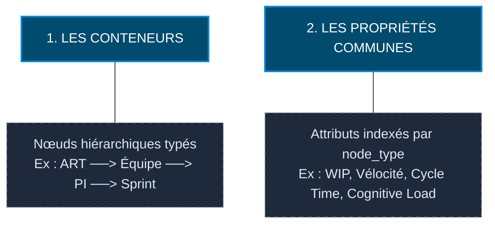

# Spécifications de l'Architecture Blackboard Étendue

L'architecture Blackboard traditionnelle, bien qu'éprouvée pour l'intégration de données et la prise de décision via une logique propositionnelle, atteint ses limites face à la complexité des trains SAFe à grande échelle : la gestion manuelle de réseaux de faits « à plat » complique la modélisation de relations organisationnelles ou spatiales complexes.

Pour y répondre, Neuro-Scale structure ses connaissances sous forme de graphes orientés et typés, avec un système d'index (par `node_type`, par `team_id`, par `severity`) qui évite un balayage linéaire du graphe complet à chaque requête. **Ce que « le Blackboard » recouvre n'est pas une structure unique** — l'audit (`ADR-036`) a établi qu'il s'agit en réalité de **trois zones mémoire distinctes**, avec des objets et des régimes de persistance différents :

| Zone | Objet réel | Fichier | Persistance |
| :--- | :--- | :--- | :--- |
| **R1** | `KnowledgeGraph` | `graph/knowledge_graph.py` | Persistant — `data/knowledge_graph_snapshot.json` (`analyze.py:2027`) |
| **R2** | `OntologyGraph` | `graph/ontology_graph.py` | **Volatile** — in-memory, TTL par `node_type` (720h), aucune méthode save/load |
| **R3** | `SprintDelta` / `HistoricalProfile` | `graph/ontology_graph.py` | Persistant — `save_temporal_profiles` |

Ce document utilise « le Blackboard » comme raccourci générique quand une affirmation vaut pour l'ensemble ; il nomme la zone précise (R1/R2/R3) partout où la persistance ou le régime d'écriture diffère selon la zone concernée.

*Retiré de cette page (2026-08-02)* : une notation de complexité $O(n) \to O(1)$ figurait ici et à la section 4, sans mesure ni benchmark associé — l'audit l'a classé non vérifiable par lecture de code. Le mécanisme réel (index par type, par équipe, par sévérité — cf. §3) est décrit ci-dessous sans revendiquer sa classe de complexité asymptotique.

---

## 1. Structuration du Réseau de Connaissances



* **Les Conteneurs :** des nœuds `networkx` typés (`ART`, `TEAM`, `PI`, `SPRINT`, `FEATURE`), reliés par des relations explicites (ex. `ART:ART-26-ALPHA --CONTIENT--> PI:PI-27`, `kg.add_relation()`, `graph/knowledge_graph.py`). La hiérarchie existe comme un ensemble de relations typées entre nœuds, pas comme une classe `Container` générique imbriquée.
* **Les Propriétés Communes :** chaque nœud porte ses attributs **à plat** (pas de typage de schéma imposé au-delà du type de nœud lui-même — `networkx` accepte des attributs libres), indexés pour un accès direct par `node_type`, `team_id` ou `severity` selon la zone (`graph/ontology_graph.py:171,264-265`).

*Retiré de cette page* : un troisième pilier (« Règles Génériques », matching post-conditionnel sur classes d'objets) figurait ici. Aucun moteur de règles de ce type n'existe dans le dépôt — voir §3 pour le détail de ce qui a été retiré.

---

## 2. Immutabilité R1 et Isolation des Cycles de Vie

Les zones R1, R2 et R3 (§0) cohabitent dans le même processus, mais ne sont **pas** un espace de mémoire unique — le canal principal de passage d'information entre nœuds du graphe d'exécution LangGraph est un `NeuroScaleState` (`core/models.py:185`, 290 lignes), pas une lecture directe du graphe par chaque agent. Une étanchéité stricte est néanmoins maintenue entre R1 et R2 :

* **Écriture Asymétrique — invariant le mieux vérifié de ce document.** Le `KnowledgeGraph` (Zone R1) est peuplé par `graph_builder.py` (`kg.add_entity()`, `kg.add_relation()`) — pas par `flow_metrics_engine.py` ni `quality_guard.py`, qui ne contiennent aucune écriture sur le graphe. Les agents R2 n'ont **aucun accès en écriture** au `KnowledgeGraph` : leur seul canal d'écriture est `publish_agent_observation()` sur l'`OntologyGraph` (Zone R2) — vérifié dans `evaluator_agent.py:182`, `diagnostic_consolidator.py:192`, `state_monitor/graph.py:140`, `retro_agent.py:116`. Aucune de ces observations n'est typée `DiagnosticEvent` (0 occurrence dans le dépôt) — le type réel est `GraphEvent` (`graph/graph_event.py:18`, champ `node_type: str`).
* **Lecture ciblée, pas universelle.** Les agents ne parcourent pas librement l'ensemble du graphe : un extrait de profondeur 1 autour du nœud `TEAM:{team_id}` concerné est construit à la demande (`_build_kg_subgraph_triples`, `state_monitor/graph.py:308-330`) et injecté dans le prompt via `r1_distillate["kg_subgraph"]` (`graph.py:739`). C'est une lecture contextuelle restreinte, pas un droit de lecture complet sur l'ensemble du graphe.
* **Persistance par Delta — propriété de la Zone R3 uniquement.** `SprintDelta`/`HistoricalProfile` (`save_temporal_profiles`) capturent des écarts d'état entre sprints pour l'historique long terme. La Zone R2 (`OntologyGraph`) n'a **aucune méthode save/load** : elle est volatile, en mémoire, avec un TTL par `node_type` (720h par défaut) géré par un bus d'événements interne — ses observations ne survivent pas à un redémarrage du processus.

---

## 3. Implémentation : Graphes et Lecture Contextuelle

### Structure de Données de l'Ontologie Graphe
Les zones R1 et R2 s'appuient toutes deux sur une structure de graphe orienté `networkx`, avec des régimes de persistance différents (§0). Un nœud réel est identifié par sa clé (ex. `TEAM:alpha`) et porte ses attributs à plat — pas de bloc `properties` imbriqué, pas de champ `entity_id` séparé de la clé. Extrait réel de la construction d'un nœud `TEAM` (`engine/knowledge/graph_builder.py:166-175`) :

```python
t_node = f"TEAM:{team_id}"
kg.add_entity(
    t_node, "TEAM",
    team_id=team_id,
    name=team.get("name"),
    team_type=team.get("type"),
    domain=team.get("domain"),
    members=team.get("members"),
    cognitive_load_budget=team.get("cognitive_load_budget"),
)
kg.add_relation(art_node, t_node, "COMPOSE_DE")
```

Les relations sont stockées comme attribut d'arête `relation` (`graph/knowledge_graph.py:87` : `self._graph.add_edge(source, target, relation=relation, **attrs)`) — pas `relation_type`. Aucun champ `type: "CONTAINER"` ni `meta_type` n'existe dans le dépôt.

La lecture de ce graphe est assurée par `GraphReader`/`LiveSprintContext`/`LivePoller` (`graph/graph_reader.py`, `graph/live_context.py`, `graph/live_poller.py`, 296 lignes cumulées, importés et actifs via `graph/__init__.py`) — composants réels, absents d'une version précédente de cette page.

*Retiré de cette page* : une section décrivait un « moteur de matching inversé » évaluant un état futur souhaité (*After State*, backward chaining) pour combler un écart de topologie ou de performance. Aucun moteur de règles inversé de ce type n'existe dans le dépôt.

---

## 4. Mécanismes réels — ce qui remplace la « Matrice d'Impact »

Une version précédente de cette section présentait un tableau de métriques de performance (complexité $O(n)\to O(1)$, risque d'hallucination "quasi-nul", cohérence "absolue") sans qu'aucune ne soit mesurée. Un tableau de métriques non mesurées se lit comme un résultat ; ce n'en est pas un. Voici les mécanismes réels qu'il prétendait résumer :

* **Recherche indexée, classe de complexité non mesurée.** Les zones R1 et R2 indexent leurs nœuds par type/équipe/sévérité (`ontology_graph.py:171,264-265`) plutôt que de parcourir l'ensemble du graphe. Aucun benchmark n'a été publié pour établir une classe de complexité asymptotique sur le système complet — à traiter comme un chantier de mesure séparé s'il devient utile de le publier.
* **Réduction du risque d'hallucination, pas son élimination.** Deux mécanismes distincts, à ne pas confondre : **en entrée**, le prompt du maker reçoit un extrait de profondeur 1 autour du nœud `TEAM:{team_id}` concerné (`_build_kg_subgraph_triples`, `state_monitor/graph.py:308-330`) — une restriction de contexte réelle, qui réduit plausiblement (sans le mesurer) le risque de dérive par rapport à un contexte non filtré. **En sortie**, le mécanisme censé vérifier que les affirmations du LLM (`kg_anchors`) sont ancrées dans le `KnowledgeGraph` est **incomplet** : `EvaluatorAgent._check_kg` (`evaluator_agent.py:128-151`) résout `state["source_id"]` contre le graphe, mais **ne résout jamais la liste `kg_anchors` elle-même** — aucun appel à `get_entity()` sur ses entrées. Le risque d'hallucination n'est donc pas « quasi-nul » : il est réduit côté entrée, et vérifié de façon incomplète côté sortie (`DRIFT-003`).
* **Unicité d'identifiant, pas de garantie de cohérence absolue.** Chaque nœud a une clé unique (`TEAM:{id}`, `FEATURE:{id}`, etc.), ce qui prévient les doublons de clé — mais rien dans le code n'établit une garantie de cohérence « absolue » des données au sens large (fraîcheur, complétude).
* **Deltas, propriété de la Zone R3 uniquement.** Cf. §2 — la Zone R2 est volatile, sans persistance du tout, ce qui n'est pas la même chose qu'une « persistance minimale par deltas ».

---

## 5. Limites Identifiées & Directives d'Évolution

Cette section reste l'une des seules du corpus à documenter des contraintes plutôt que des garanties — elle est conservée et enrichie des limites confirmées par l'audit du 2026-08-02 :

* **Hiérarchies imbriquées :** la gestion de relations imbriquées sur plusieurs niveaux (ex. une Story dépendante d'un composant partagé entre plusieurs équipes) nécessite une indexation soignée. Aucune mesure de temps de parcours (*traversal time*) n'est instrumentée à ce jour — la limite est plausible, la métrique nommée ne l'est pas.
* *Retiré, non confirmé et contradictoire avec ADR-021* : une affirmation selon laquelle le `DependencyAgent` « isole et purge les liens obsolètes à chaque fin de sprint » figurait ici. `dependency_agent.py` ne contient **aucune méthode de purge ni aucune écriture sur le graphe** — et une telle purge, si elle existait, violerait ADR-021 (interdiction stricte d'écriture R2 sur R1). La phrase décrivait une opération à la fois inexistante et interdite par l'architecture elle-même.
* **Zone R2 volatile (limite réelle, non documentée jusqu'ici) :** les observations publiées par les agents R2 sur l'`OntologyGraph` ne survivent pas à un redémarrage du processus — aucune persistance entre runs.
* **Vérification d'ancrage incomplète (limite réelle, non documentée jusqu'ici) :** cf. §4 — `DRIFT-003`. Les `kg_anchors` produits par le LLM ne sont pas résolus contre le `KnowledgeGraph`.