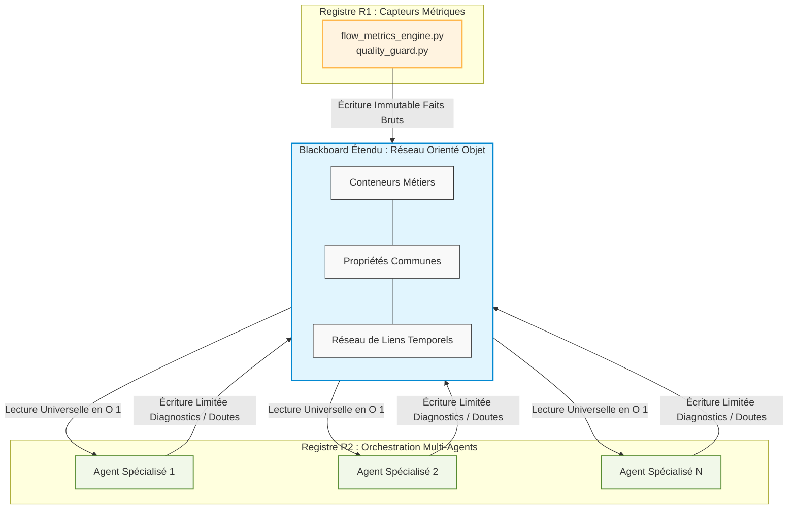

# Le Cerveau Central & Orchestration Agentique

La Couche 4 de Neuro-Scale donne vie au framework à travers une armée de **8 agents cognitifs spécialisés**. Pour éviter le chaos décisionnel et garantir une exécution logicielle rigoureuse, ces agents ne travaillent pas en silo. Ils sont gouvernés, coordonnés et arbitrés par un noyau de composants exécutifs appelé le **Cerveau Core**.

Ce cœur exécutif repose sur deux composants majeurs :
1. **`flow_dispatcher.py` (Le Routeur) :** Le point d'entrée qui qualifie la complexité et aiguille les flux.
2. **`diagnostic_orchestrator.py` (L'Orchestrateur) :** Le corrélateur central qui assemble les faits sur le Tableau (Blackboard) et valide la cohérence des diagnostics.

---

## 1. L'Architecture Blackboard Étendue

Contrairement aux architectures agentiques traditionnelles "en chaîne" (Chaining) où les agents s'appellent les uns les autres au risque de dériver ou de saturer leur contexte, Neuro-Scale utilise un modèle de **Blackboard Étendu (Orienté Objet)**.


### Principes de fonctionnement :
* **Découplage absolu :** Les 8 agents ne se connaissent pas et n'interagissent pas directement. Ils lisent et écrivent exclusivement sur un espace de mémoire partagé et structuré : le Blackboard.
* **Complexité Optimisée en $O(1)$ :** La transition d'un schéma propositionnel ("faits à plat") vers un réseau orienté objet (Conteneurs, Propriétés Communes, Liens) permet au système de scanner et de faire correspondre les règles à la volée, indépendamment de la taille du train.
* **Immutabilité du Registre R1 :** Les composants R1 (Capteurs) écrivent les données factuelles brutes sur le Blackboard. Les agents R2 ont un droit de lecture universel, mais un droit d'écriture limité uniquement à la publication de leurs diagnostics ou de leurs doutes. **L'IA ne peut jamais falsifier une mesure algorithmique.**

---

## 2. Le Dispatcher de Flux & Le Routage Cynefin

Le fichier `flow_dispatcher.py` (adossé à `cynefin_router.py`) est le premier composant à intercepter un événement ou une anomalie détectée sur le train. Il applique une logique de classification stricte basée sur le Cadre Cynefin :

```mermaid
graph TD
    %% Styles
    classDef default fill:#f9f9f9,stroke:#333,stroke-width:1px;
    classDef core fill:#e1f5fe,stroke:#0288d1,stroke-width:2px;
    classDef r1 fill:#fff3e0,stroke:#ffb74d,stroke-width:1.5px;
    classDef r2 fill:#f1f8e9,stroke:#558b2f,stroke-width:1.5px;

    Signal[Signal d'Anomalie / Événement] --> Router
    Router[cynefin_router.py] --> Dispatch{flow_dispatcher.py}
    
    Dispatch -->|Domaine Compliqué| Algorithme[ROUTAGE ALGORITHMIQUE<br/>Registre R1 Pure]
    Dispatch -->|Domaine Complexe| Agentique[ROUTAGE AGENTIQUE<br/>Registre R2 Blackboard]

    subgraph R1_Proc [Traitement Déterministe]
        Algorithme --> ToC[Calcul de Contraintes<br/>NetworkX / Chemin Critique]
        ToC --> Res1[Complexité : Mathématique]
    end

    subgraph R2_Proc [Orchestration Cognitive]
        Agentique --> LLM[Analyse Sémantique Multi-Agents<br/>Prompts Structurés]
        LLM --> Res2[Complexité : Organisationnelle]
    end

    class Router,Dispatch core;
    class Algorithme,ToC,Res1 r1;
    class Agentique,LLM,Res2 r2;
    ```

* **Le Domaine Compliqué (Routage Algorithmique) :** Si la problématique est purement technique ou mathématique (ex : calcul exact d'un chemin critique, détection d'une dépendance cyclique Jira, rupture d'un seuil de capacité), le signal reste dans le Registre R1. Il est traité par des bibliothèques déterministes (ex : NetworkX pour les graphes) sans aucune sollicitation d'un Modèle de Langage.
* **Le Domaine Complexe (Routage Agentique) :** Si le signal implique des facteurs humains, sémantiques ou comportementaux (ex : suspicion d'un alignement OKR artificiel, détection d'un anti-pattern SAFe dans la rédaction des objectifs, baisse de sécurité psychologique en équipe), le dispatcher réveille l'armée d'agents du Registre R2 appropriée.

---

## 3. L'Orchestrateur de Diagnostics (`diagnostic_orchestrator.py`)

Une fois les agents activés par le dispatcher, le `DiagnosticOrchestrator` supervise leur cycle de vie et consolide leurs livrables. Son rôle est d'assurer la cohérence et la traçabilité de la décision.

### Le Format Impératif RPD (ADR-006)

Pour éliminer le bavardage inutile des LLM, le Cerveau Core impose à tous les agents un format de sortie standardisé et compact appelé **RPD (Recognition-Primed Decision)**. Un diagnostic d'agent fait systématiquement 5 lignes maximum :
* **R (Action Recommandée) :** L'action prioritaire et concrète immédiate proposée au RTE ou Scrum Master.
* **P (Pattern / Problème) :** Le dysfonctionnement sémantique ou structurel identifié sur le train.
* **D (Données Probatoires) :** Les faits mathématiques bruts issus de R1 qui prouvent le problème.
* **T (Traçabilité) :** Le `rule_id` exact du distillat framework à l'origine de la règle de décision.
* **C (Confiance) :** Le label de certitude croisé (`CALCULÉ` | `PROBABLE` | `NON VÉRIFIÉ`).

### Exemple de payload consolidé par l'Orchestrateur :

```json
{
  "orchestrator_job_id": "ORCH-2026-0521-A",
  "timestamp": 1779366060000,
  "agent_source": "DependencyAgent",
  "domain_complexity": "COMPLEX",
  "rpd_output": {
    "recommandation": "Reporter la Feature [ID-91] au PI suivant ou transférer le composant d'architecture à l'équipe Complicated-Subsystem.",
    "pattern": "Anti-pattern SAFe #12 : Silo architectural masqué par des rituels de synchronisation artificiels.",
    "donnees_probatoires": "3 tickets otages détectés; 24 Story Points bloqués sur l'Équipe B depuis 14 jours; score QualityGuard = 0.94.",
    "trace": "TeamTopologies-JSON | Rule_ID: TT-042",
    "confiance": "CALCULÉ"
  }
}
```

##  4. Cran de Sûreté Systémique : interrupt()

Le DiagnosticOrchestrator est également le gardien de la règle d'or de la gouvernance (ADR-001). Il orchestre les dépendances temporelles via le temporal_engine.py.

Lorsqu'on bascule en Mode Commando (PI Readiness à J-15), si un indicateur de niveau vert (comme la Charge Cognitive Sweller ou l'indice de maturité du backlog calculé par le pi_readiness_engine.py) franchit un seuil critique d'alerte fatale, l'orchestrateur déclenche immédiatement la fonction primitive interrupt().

Effet de l'interruption : Le graphe LangGraph s'arrête instantanément. La génération automatisée des rapports est verrouillée. L'infrastructure se fige et exige une action ou un forçage manuel (HITL de Niveau 2 ou 3) du Release Train Engineer pour reprendre son cours, garantissant qu'aucune décision stratégique n'est prise à l'aveugle.