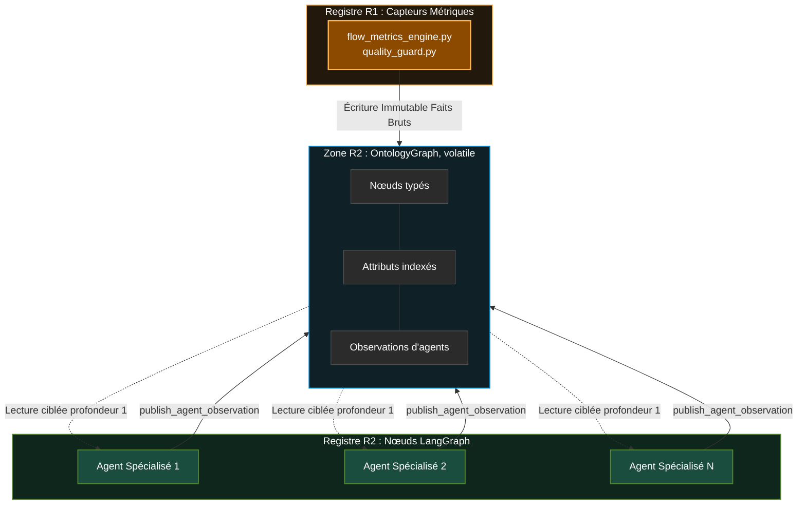
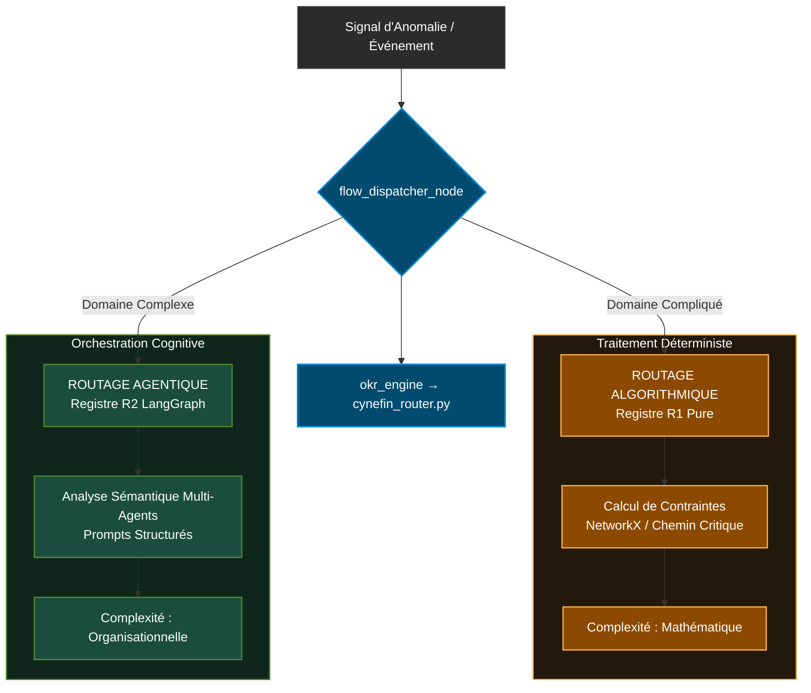

# Le Cerveau Central & Orchestration Agentique

La Couche 4 de Neuro-Scale s'appuie sur plusieurs agents spécialisés (registre complet et compte vérifié : `02-moteur-architecture/Registres.mdx`). Ils ne s'appellent pas directement entre eux : ils sont des nœuds d'un graphe **LangGraph** compilé (`agents/orchestrators/state_monitor/graph.py`), relié par un routage conditionnel explicite.

Deux composants sont fréquemment cités ici, avec des rôles à préciser :
1. **`flow_dispatcher_node`** (`state_monitor/graph.py:653`) : un nœud de classification Cynefin, en **4e position** du graphe — après `budget_guard` (le véritable point d'entrée, `set_entry_point`), `sentinel_loader` et `consolidator`. Il n'est pas le point d'entrée du système.
2. **`diagnostic_orchestrator.py`** : *correction, point le plus important de cette page* — ce module ne « corrèle » ni n'« assemble » rien sur un quelconque Blackboard. C'est un moteur de règles pur (dataclasses + règles de corrélation), **zéro import du Blackboard, zéro appel d'agent, zéro écriture** — sa docstring le dit elle-même (« Zéro LLM, zéro LangGraph »), et sa seule dépendance externe est `temporal_engine.TemporalContext`. Le chef d'orchestre réel est le graphe LangGraph lui-même ; le nœud qui clôture une session de diagnostic est `arbiter_node` (`graph.py:1019`).

---

## 1. Routage LangGraph et Zone R2

Contrairement aux architectures agentiques "en chaîne" (Chaining) où les agents s'appellent les uns les autres, Neuro-Scale utilise un **graphe LangGraph à routage explicite**, avec un canal complémentaire — la Zone R2 (`OntologyGraph`) — pour les observations publiées par les agents. Détail complet des trois zones mémoire (R1/R2/R3) : `02-moteur-architecture/blackboard-etendu.md`.

```mermaid
graph TD
    %% Styles
    classDef default fill:#2b2b2b,stroke:#555,stroke-width:1px,color:#ffffff;
    classDef reg1 fill:#8c4a00,stroke:#ffb74d,stroke-width:2px,color:#ffffff;
    classDef board fill:#004b6e,stroke:#0288d1,stroke-width:2px,color:#ffffff;
    classDef agent fill:#1b4d3e,stroke:#558b2f,stroke-width:1.5px,color:#ffffff;

    %% Styles spécifiques pour les subgraphs
    style R1 fill:#23180c,stroke:#ffb74d,stroke-width:1.5px,color:#ffffff;
    style BB fill:#0f2027,stroke:#0288d1,stroke-width:1.5px,color:#ffffff;
    style R2 fill:#0f261c,stroke:#558b2f,stroke-width:1.5px,color:#ffffff;

    %% Ingestion Registre R1
    subgraph R1 [Registre R1 : Capteurs Métriques]
        Capteurs[flow_metrics_engine.py<br/>quality_guard.py]
    end

    %% Zone R2
    subgraph BB [Zone R2 : OntologyGraph, volatile]
        direction TB
        Conteneurs[Nœuds typés]
        Proprietes[Attributs indexés]
        Liens[Observations d'agents]
        Conteneurs --- Proprietes
        Proprietes --- Liens
    end

    %% Nœuds de Couche 4
    subgraph R2 [Registre R2 : Nœuds LangGraph]
        A1[Agent Spécialisé 1]
        A2[Agent Spécialisé 2]
        A3[Agent Spécialisé N]
    end

    %% Interconnexions
    Capteurs -->|Écriture Immutable Faits Bruts| BB
    BB -.->|Lecture ciblée profondeur 1| A1
    BB -.->|Lecture ciblée profondeur 1| A2
    BB -.->|Lecture ciblée profondeur 1| A3

    A1 -->|publish_agent_observation| BB
    A2 -->|publish_agent_observation| BB
    A3 -->|publish_agent_observation| BB

    %% Assignation classes
    class Capteurs reg1;
    class BB board;
    class A1,A2,A3 agent;
```
### Principes de fonctionnement :
* **Routage explicite :** les agents sont des nœuds appelés par le routeur du graphe (`ontology_category_router`, `specialist_maker_router`), pas des observateurs volontaires d'un tableau partagé.
* **Lecture ciblée, pas universelle :** le prompt d'un maker reçoit un extrait de profondeur 1 autour du nœud `TEAM:{team_id}` concerné (`_build_kg_subgraph_triples`, `graph.py:308-330`), pas un accès complet et non mesuré au graphe. *Retiré : une notation de complexité $O(1)$ figurait ici sans mesure — cf. `blackboard-etendu.md` pour le détail de ce retrait.*
* **Immutabilité du Registre R1 :** `graph_builder.py` peuple le `KnowledgeGraph` (Zone R1). Le seul canal d'écriture des agents R2 est `publish_agent_observation()` sur la Zone R2 — aucune écriture sur le `KnowledgeGraph` n'a été trouvée côté R2. **L'IA ne peut jamais falsifier une mesure algorithmique** — c'est l'invariant le mieux vérifié de tout le corpus (`ADR-021`).

---

## 2. Le Dispatcher de Flux & Le Routage Cynefin

*Correction d'ordre* : `flow_dispatcher_node` n'est pas le premier composant à intercepter un événement — `budget_guard` est le point d'entrée réel du graphe (cf. introduction ci-dessus). Une fois atteint, `flow_dispatcher_node` appelle `okr_engine.build_flow_dispatcher_analysis` (`okr_engine.py:189`), qui appelle à son tour `cynefin_router.classify_cynefin` — le sens réel de l'appel est donc `flow_dispatcher` → `okr_engine` → `cynefin_router`, l'inverse de ce qu'un schéma précédent montrait ici :

```mermaid
graph TD
    %% Styles
    classDef default fill:#2b2b2b,stroke:#555,stroke-width:1px,color:#ffffff;
    classDef core fill:#004b6e,stroke:#0288d1,stroke-width:2px,color:#ffffff;
    classDef r1 fill:#8c4a00,stroke:#ffb74d,stroke-width:1.5px,color:#ffffff;
    classDef r2 fill:#1b4d3e,stroke:#558b2f,stroke-width:1.5px,color:#ffffff;

    %% Styles spécifiques pour les subgraphs
    style R1_Proc fill:#23180c,stroke:#ffb74d,stroke-width:1.5px,color:#ffffff;
    style R2_Proc fill:#0f261c,stroke:#558b2f,stroke-width:1.5px,color:#ffffff;

    Signal[Signal d'Anomalie / Événement] --> Dispatch
    Dispatch{flow_dispatcher_node} --> Router[okr_engine → cynefin_router.py]
    
    Dispatch -->|Domaine Compliqué| Algorithme[ROUTAGE ALGORITHMIQUE<br/>Registre R1 Pure]
    Dispatch -->|Domaine Complexe| Agentique[ROUTAGE AGENTIQUE<br/>Registre R2 LangGraph]

    subgraph R1_Proc [Traitement Déterministe]
        Algorithme --> ToC[Calcul de Contraintes<br/>NetworkX / Chemin Critique]
        ToC --> Res1[Complexité : Mathématique]
    end

    subgraph R2_Proc [Orchestration Cognitive]
        Agentique --> LLM[Analyse Sémantique Multi-Agents<br/>Prompts Structurés]
        LLM --> Res2[Complexité : Organisationnelle]
    end

    class Router,Dispatch core;
    class Algorithme,ToC,Res1 r1;
    class Agentique,LLM,Res2 r2;
```

* **Le Domaine Compliqué (Routage Algorithmique) :** Si la problématique est purement technique ou mathématique (ex : calcul exact d'un chemin critique, détection d'une dépendance cyclique Jira, rupture d'un seuil de capacité), le signal reste dans le Registre R1. Il est traité par des bibliothèques déterministes (ex : NetworkX pour les graphes) sans aucune sollicitation d'un Modèle de Langage.
* **Le Domaine Complexe (Routage Agentique) :** Si le signal implique des facteurs humains, sémantiques ou comportementaux (ex : suspicion d'un alignement OKR artificiel, détection d'un anti-pattern SAFe dans la rédaction des objectifs, baisse de sécurité psychologique en équipe), le dispatcher réveille l'armée d'agents du Registre R2 appropriée.

---

## 3. Ce que fait réellement `diagnostic_orchestrator.py`

*Réécriture complète de cette section (2026-08-02)* : une version précédente présentait ce module comme le chef d'orchestre du système — supervisant le cycle de vie des agents, consolidant leurs livrables sur le Blackboard, rejetant les publications non conformes. **Aucune de ces affirmations n'est vraie.** Vérifié : zéro import du Blackboard/`OntologyGraph`, zéro appel d'agent, zéro écriture sur une quelconque zone mémoire. Le module contient des dataclasses et 11 règles de corrélation pures (chiffre issu de sa docstring), sa seule dépendance externe est `temporal_engine.TemporalContext`, et sa propre docstring l'affirme : « Zéro LLM, zéro LangGraph ». Il produit des `DiagnosticTrigger` consommés en aval par `pattern_detector`.

Le vrai chef d'orchestre est le **graphe LangGraph** (`state_monitor/graph.py`) : c'est lui qui active les nœuds/agents via son routage conditionnel, et **`arbiter_node`** (`graph.py:1019`) qui clôture une session de diagnostic (APPROVE / RETRY / HITL).

### Le Format Réel RPD (ADR-006)

*Correction* : RPD signifie **Recommandation / Preuve / Diagnostic**, pas « Recognition-Primed Decision » (qui est un modèle de prise de décision de Gary Klein, une inspiration conceptuelle différente, correctement citée par ailleurs dans `theories-base.md`). Le format réel a **3 champs**, pas 5 — implémenté sur 3 agents (capacity, predictive_engine, value_arbitrator), sans validation de schéma généralisée :
* **R (Recommandation) :** l'action proposée.
* **P (Preuve — R1) :** les faits déterministes qui la fondent.
* **D (Diagnostic — R2) :** l'interprétation sémantique de l'agent.

*Retirés, non confirmés* : un champ `T` (Traçabilité/`rule_id`) et un champ `C` (Confiance) — aucun payload d'agent ne les contient. Le check `_check_rule_id` existe bien, mais dans l'**EvaluatorAgent** (`agents/evaluators/evaluator_agent.py`), pas dans `diagnostic_orchestrator.py`, et il ne « rejette » pas une publication sur un Blackboard : il fait partie des 4 checks PASS/REJECT du Maker-Checker (cf. `02-moteur-architecture/agents-specialite.md`, §5).

## 4. Cran de Sûreté Systémique : routage conditionnel vers `human_review`

*Correction* : `diagnostic_orchestrator.py` n'est ni un gardien de gouvernance ni un orchestrateur de dépendances temporelles — il n'importe même pas LangGraph. Le mécanisme réel appartient au graphe : si le score DoR calculé passe sous 60 % (`state.get("dor_score", 100.0) < 60.0`, `graph.py:396`), le routage conditionnel dirige vers le nœud `human_review`, et le graphe compilé déclare `interrupt_before=["human_review"]` (`graph.py:1289`) — pas un appel direct à une fonction `interrupt()`. Le seul `interrupt()` du dépôt se trouve dans un module orphelin, jamais importé (`agents/rituals/pi_readiness_graph.py:118`, cf. `04-gouvernance-ethique/decisions-index.md`, `DRIFT-036`).

Effet réel : le graphe s'arrête avant d'exécuter `human_review`, en attente d'une action du RTE. Aucune preuve n'a été trouvée d'un verrouillage automatique de la génération de rapports ni d'un forçage manuel tracé (cf. `03-guides-roles/rte-pi-readiness.md` pour le détail de cette vérification).