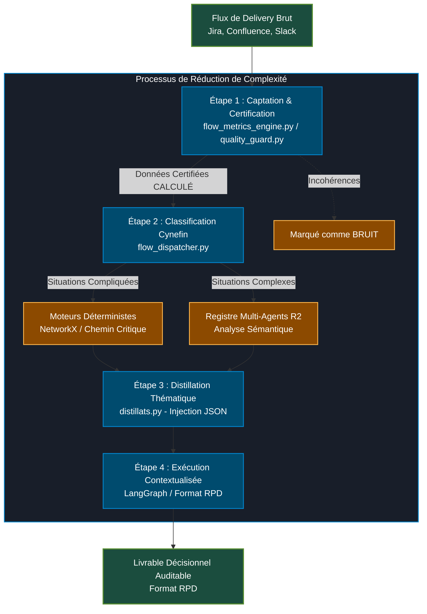
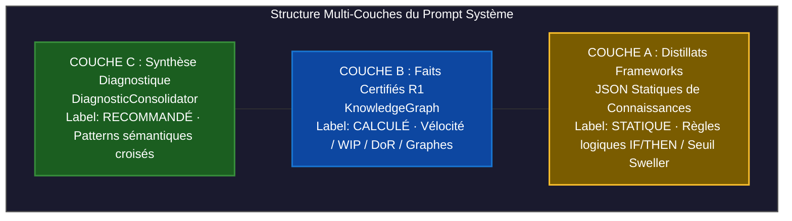

# Le Filtre Contextuel & Traitement des Signaux

La puissance brute d'un modèle de langage (LLM) est inutile, voire dangereuse, si elle est appliquée directement sur le flux désordonné d'une infrastructure d'entreprise. Injecter des milliers de tickets Jira ou des logs Slack non triés dans un prompt système conduit inévitablement à deux pathologies logicielles : la **saturation du contexte** (infobésité) et l'**hallucination architecturale**.

La Couche 2 de Neuro-Scale agit comme un **interrupteur et filtre contextuel**. Elle intercepte les signaux bruts, les passe au tamis des 7 piliers organisationnels (SAFe, Team Topologies, ToC) et génère un **Distillat** hyper-filtré, mathématiquement exact et sémantiquement structuré.

---

## 1. Le Flux de Transformation du Signal

Le framework appliquant une logique de réduction de la complexité en quatre étapes successives :

### Étape 1 : Captation et Certification (Registre R1)
Les "Capteurs" de la Couche 3 (`flow_metrics_engine.py`, `quality_guard.py`) extraient les faits bruts des outils de delivery (Jira, Confluence). 
* **Action :** Le système valide l'intégrité de la donnée. Si une User Story n'est pas conforme aux critères INVEST ou si une Feature n'a pas de critères d'acceptation, le `Quality Guard` la marque comme `Bruit`. Les données certifiées reçoivent le badge `CALCULÉ`.

### Étape 2 : Classification par la Complexité (Cynefin Router)
Le nœud `flow_dispatcher_node` qualifie la nature de l'anomalie ou de la friction selon le cadre Cynefin — *précision d'ordre* : il délègue le calcul à `okr_engine.build_flow_dispatcher_analysis`, qui appelle `cynefin_router.classify_cynefin` (cf. `02-moteur-architecture/cerveau-core.md`) :
* **Situations Compliquées :** Routées vers des moteurs de calcul purement déterministes (ex : calcul d'un chemin critique de dépendances via NetworkX).
* **Situations Complexes :** Routées vers l'orchestration multi-agents du Registre R2 pour une analyse probabiliste et sémantique.

### Étape 3 : Distillation Thématique (`distillats.py`)
Pour l'analyse agentique, le module extrait statiquement les règles métiers (fichiers JSON dans `Documentation/` — *correction de chemin*) correspondant à l'arborescence de l'organisation. Chaque agent paramètre lui-même le volume de règles reçu (`max_rules`, `include_rules`/`include_signals`/`include_antipatterns`) — *correction : pas de classification « Distillats Primaires vs Secondaires », cf. `02-moteur-architecture/gestion-distillats.md`.*

### Étape 4 : Exécution Contextualisée (Registre R2)
L'agent s'exécute comme un nœud du graphe LangGraph, avec un canal complémentaire vers la Zone R2 (`OntologyGraph`). Son livrable de sortie est structuré au format **RPD (Recommandation / Preuve / Diagnostic** — *correction : pas « Recognition-Primed Decision »*), sur 3 agents seulement, sans identifiant `rule_id` généralisé (la convention réelle des distillats est un `id` court par catégorie, ex. `R2`, `P1` — cf. `02-moteur-architecture/gestion-distillats.md`).

---

## 2. Anatomie d'un Distillat à l'Exécution

Le "Distillat" final poussé dans le prompt système d'un agent de la Couche 4 n'est pas une simple chaîne de texte. C'est une **superposition dynamique de trois couches de confiance** :

### Exemple de Prompt Injecté (`_FRAMEWORK_HEADER`)
*Correction* : `DependencyAgent` n'injecte aucun distillat (zéro LLM, cf. `02-moteur-architecture/agents-specialite.md`) — l'exemple ci-dessous illustre le mécanisme réel pour un agent qui en injecte effectivement, comme `MentorAgent` :

#### Référentiel Décisionnel NEURO-SCALE (Couche A - Statique)
* **Source :** `TeamTopologies.json` | Id de règle : `R2` (*correction : convention réelle des distillats — pas de clé `rule_id` ni d'identifiant `TT-042`, cf. `02-moteur-architecture/gestion-distillats.md`*)
* **Règle :** une interaction de type Collaboration entre deux équipes dépassant 8 semaines consécutives signale un goulot d'étranglement déguisé (`niveau_hitl: 2`).

#### Faits Certifiés R1 (Couche B - Calculé)
* **Statut :** `CALCULÉ` (QualityGuard Score: 0.94)
* **Métriques :** CycleTime: +14j | Tickets_Otages: 3 | Story_Points_Bloqués: 24.
* **Graphe :** Dépendance cyclique détectée entre l'Équipe A et l'Équipe B.

#### Diagnostic Consolidé (Couche C - Recommandé)
* **Pattern détecté :** Anti-pattern SAFe #12 (Architecture en silo masquée par des rituels de synchronisation artificiels).

---

## 3. Les Trois Niveaux de Confiance de l'Interface

Grâce au filtrage contextuel, l'interface utilisateur (le design Bento Grid) et le Release Train Engineer disposent d'un indicateur de transparence absolue sur la provenance des informations :

* **CALCULÉ (Indice de Haute Fidélité) :** Généré uniquement lorsque les données brutes de R1 sont complètes et que le fondement scientifique associé est de niveau vert (ÉTABLI).
* **PROBABLE (Marge d'Erreur) :** Activé si les données R1 sont partielles ou si le diagnostic s'appuie sur une théorie organisationnelle de niveau jaune (Robuste, nécessitant l'interprétation humaine).
* **NON VÉRIFIÉ (Sécurité Systémique) :** Déclenché si le score du `Quality Guard` s'effondre (données Jira corrompues ou incohérentes). Le système verrouille alors le registre R2 et refuse d'émettre des recommandations pour empêcher toute prise de décision basée sur des hallucinations.

---

## 4. Traçabilité Totale et Immutabilité

* **Immutabilité des Faits :** Le Filtre Contextuel garantit qu'aucun agent de l'infrastructure R2 ne possède les droits d'écriture sur le Registre R1. L'IA peut interpréter les métriques de flux, elle ne peut en aucun cas les modifier ou les lisser.
* **Auditabilité :** Chaque notification reçue par le management affiche en note de bas de page la traçabilité complète de son filtrage :
  > `[Diagnostic: MentorAgent | Source: R1-QualityGuard | Distillat: TeamTopologies-JSON | Id: R2 | Confiance: CALCULÉ]`