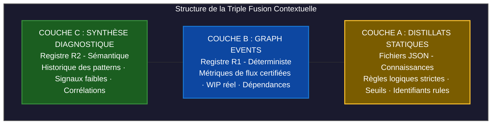

# Le Moteur de Gestion des Distillats

L'un des défis majeurs de l'ingénierie agentique en entreprise est le contrôle du comportement des Modèles de Langage (LLM). Laisser un agent interroger un grand modèle en s'appuyant uniquement sur sa mémoire générale expose le système aux hallucinations réglementaires. À l'inverse, lui injecter des méthodologies entières (comme le framework SAFe de plusieurs centaines de pages) sature sa fenêtre de contexte et dégrade ses capacités de raisonnement.

Neuro-Scale résout ce paradigme par son **Moteur de Gestion des Distillats** (`distillats.py`). Ce composant extrait, filtre et assemble dynamiquement des fragments de connaissances méthodologiques stricts pour formater le prompt système de chaque agent à l'exécution.

---

## 1. Le Principe de la Triple Fusion Contextuelle

*Correction* : l'injection des distillats n'est pas orchestrée par un composant central — `diagnostic_orchestrator.py` ne fait ni appel d'agent ni injection de prompt (cf. `02-moteur-architecture/cerveau-core.md`). Chaque agent construit lui-même son en-tête de contexte à l'import de son module, en appelant directement `build_framework_context()` (`_bfc`) — **5 agents sur l'ensemble du registre le font** : `MentorAgent`, `StrategicAdvisor`, `RetroAgent`, `TriageAgent`, `BacklogAgent`. Le Maker principal du graphe, `executor_node`, n'en injecte aucun. Le moteur compile une invite en superposant trois niveaux de données :



* **La Couche A (Statique) :** Les règles des frameworks (Team Topologies, Théorie des Contraintes, OODA, VSM, Wardley) stockées en JSON — *correction de chemin* : dans `Documentation/`, pas `knowledge/` (`distillats.py:32`).
* **La Couche B (Calculée) :** Les faits mathématiques bruts extraits en temps réel par les capteurs déterministes du Registre R1.
* **La Couche C (Recommandée) :** Les conclusions et patterns sémantiques identifiés lors des cycles précédents, publiés par les agents R2 sur la Zone R2 (`OntologyGraph`, `publish_agent_observation()`).

---

## 2. Spécification Technique de `distillats.py`

Le composant charge et distribue les règles selon une matrice de dépendances optimisée en mémoire via un cache de type LRU (`lru_cache`), évitant les accès disque redondants.

Structure réelle d'un fichier de distillat (`Documentation/TeamTopologies.json`) — *remplace un schéma précédent (`rules[]`, `rule_id`, `TT-042`) sans aucune correspondance dans les 5 fichiers réels* :

```json
{
  "framework": "Team Topologies",
  "auteur": "Matthew Skelton et Manuel Pais",
  "annee": "2019",
  "agent_cible": "NEURO-SCALE Architect & Flow Optimizer",
  "principes_fondateurs": [
    { "id": "P1", "principe": "Primauté de la Charge Cognitive", "implication_agent": "L'agent doit rejeter toute affectation de périmètre dépassant la mémoire de travail d'une équipe type (5-9 personnes)." }
  ],
  "regles_decisionnelles": [
    { "id": "R2", "si": "Une interaction de type 'Collaboration' entre deux équipes dépasse 8 semaines consécutives", "alors": "Signaler un goulot d'étranglement déguisé et recommander une interface X-as-a-Service ou une fusion de périmètre.", "niveau_hitl": 2 }
  ],
  "signaux_alerte": [
    { "id": "S2", "signal": "Saturation Cognitive (Context-Switching)", "seuil": "> 3 domaines métier distincts par équipe", "urgence": "CRITIQUE" }
  ],
  "anti_patterns": [
    { "id": "AP2", "pattern": "Platform as a Ticket Queue", "risque": "Transformation de la plateforme en goulot d'étranglement centralisé au lieu d'un libre-service." }
  ],
  "metriques_calculables": [
    { "id": "M2", "nom": "Hand-off Ratio", "formule": "external_dependencies_waiting_time / lead_time_total", "interpretation": "Mesure l'autonomie de l'équipe Stream-aligned ; doit tendre vers 0." }
  ]
}
```

Note technique (documentée dans le code lui-même, `distillats.py:14-20`) : `TeamTopologies.json` et `WardleyMap.json` contiennent des résidus `[cite_start]`/`[cite: N]` de génération — le même défaut que celui purgé du site documentaire (cf. `03-guides-roles/rte-pi-readiness.md`). Le chargeur les neutralise automatiquement (`_load_json_tolerant()`) ; ce n'est pas un défaut fonctionnel, mais un nettoyage qui reste à faire sur les fichiers sources eux-mêmes, hors périmètre de ce lot documentaire.

Il n'existe pas de clé `rule_id` ni de convention `TT-042` : chaque règle porte un `id` court (`P1`, `R2`, `S2`, `AP2`, `M2`), propre à sa catégorie (`principes_fondateurs`, `regles_decisionnelles`, `signaux_alerte`, `anti_patterns`, `metriques_calculables`).

### Exemple réel d'en-tête généré (`build_framework_context`, `mentor_agent.py:29-34`)

Un agent qui injecte ce distillat obtient un bloc de contexte assemblé par `build_framework_context("team_topologies", ...)` — une fonction de chargement déterministe (zéro LLM), pas un mécanisme de « fusion » orchestré par un tiers. Le format exact du bloc dépend des paramètres passés (`include_rules`, `include_signals`, `include_antipatterns`, `max_rules`) ; il n'a pas été reconstruit ici pour éviter de fabriquer un second exemple non vérifié — se référer directement à `knowledge/distillats.py:135-150` pour la spécification de fonction.

---

## 3. Granularité réelle : paramètres de `build_framework_context`

*Correction* : une distinction « Distillats Primaires (Mastery) / Secondaires (Guardrails) » figurait ici — aucune trace de ce vocabulaire ni de ce mécanisme à deux niveaux dans `distillats.py`. La granularité réelle est plus simple : chaque appel à `build_framework_context()` choisit son propre `max_rules` et active ou non `include_rules`/`include_signals`/`include_antipatterns` — un réglage par agent, pas une classification à deux niveaux nommée. `DependencyAgent`, cité en exemple ici, **n'injecte aucun distillat** (vérifié : 0 occurrence de `build_framework_context` dans `dependency_agent.py`, cohérent avec son statut zéro-LLM documenté dans `02-moteur-architecture/agents-specialite.md`).

---

## 4. Sûreté logicielle & Maintenance Centralisée

*Ces deux garanties étaient présentées comme acquises. Vérification faite, ce sont précisément les deux propriétés que le code n'a pas — corrigées ci-dessous plutôt que reformulées, pour ne pas masquer l'écart.*

* **Zéro dérive de version — non tenu.** L'exemple donné ici (« passer de 40-65% à 50-70% en un seul endroit ») est **précisément le cas où il faut éditer du Python** : les seuils Sweller (`FLOW_ZONE_MIN`/`FLOW_ZONE_MAX`) sont codés en dur dans `capacity_agent.py`, pas dans un distillat. Et la propagation ne toucherait de toute façon que les **5 agents** qui injectent effectivement un distillat (`MentorAgent`, `StrategicAdvisor`, `RetroAgent`, `TriageAgent`, `BacklogAgent`) — pas « l'ensemble de l'armée d'agents ». Ceci infirme l'intention de centralisation documentée par ailleurs (cf. `04-gouvernance-ethique/decisions-index.md`, `DRIFT-005` : ~60 seuils métier codés en dur, 0 lu depuis un distillat).
* **Auditabilité de bout en bout — chaîne rompue à la source.** Le check `_check_rule_id` existe bien (`EvaluatorAgent`, pas un mécanisme de `distillats.py`), mais **aucun `rule_id` n'est présent dans les distillats sources** (§2 : les clés réelles sont `id` par catégorie — `P1`, `R2`, `S2`…). Le check vérifie une référence vers un référentiel qui ne contient pas cette clé sous ce nom — la chaîne d'auditabilité est rompue avant même d'atteindre l'agent.